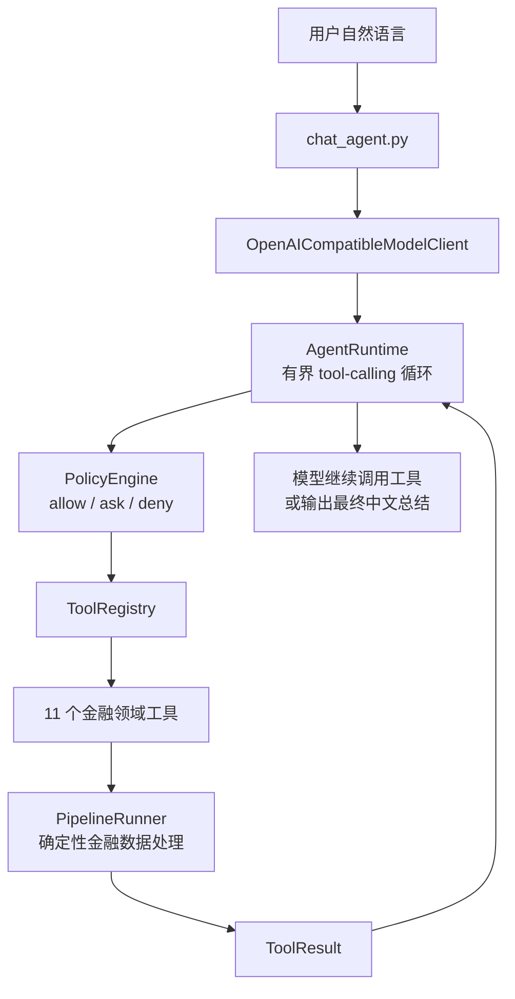

# Financial Table Workflow Agent

**用一句自然语言，让 LLM Agent 自主把原始金融表格加工成 analysis-ready 建模宽表，并产出中文报告。**

> **这是一个可运行的 Agent Demo，不是生产级系统。** 它把确定性金融数据 Pipeline 与模型驱动的
> tool-calling Agent 结合，演示"自然语言 → 自主工具调用 → 报告"的完整闭环。

```powershell
python -B src/chat_agent.py --output_base outputs_agent --max_tool_turns 20 `
  --prompt "获取贵州茅台600519从2024年1月1日至2024年6月30日的真实市场数据，生成用于五日收益率研究的建模宽表，检查未来函数和标签泄漏，必要时安全修复，最后生成完整中文报告。" `
  --auto_approve_data_fetch --auto_approve_remediation
```

---

## 文档导航

| 想知道什么 | 看这里 |
|---|---|
| **LLM Agent 怎么跑、怎么审批、怎么排查**（重点） | **[docs/LLM_AGENT.md](docs/LLM_AGENT.md)** |
| 确定性七阶段 Pipeline 在做什么、为什么 | [docs/PIPELINE.md](docs/PIPELINE.md) |
| 目录结构、模块职责、调用链 | [CODE_STRUCTURE.md](CODE_STRUCTURE.md) |
| 分阶段开发过程记录（Stage 2–12） | [docs/archive/](docs/archive/) |

---

## 这是什么

把原始金融表格（行情、成交、财务、行业、交易日历）自动加工成一张干净的 **analysis-ready 建模宽表**，
供下游建模使用，全过程留下可审计的 profile / plan / execution log / validation report / repair log。

- **只做数据准备**：不选股、不择时、不预测涨跌、不训练模型、不输出投资建议、不连接券商交易系统。
- **只用真实市场数据**：合成样例数据及其生成逻辑已彻底移除；输入缺失时明确失败，**绝不静默回退**。
- **LLM 决策 + 确定性执行**：金融计算全部由确定性 Pipeline 完成；LLM 只负责理解意图、选择工具、决定下一步。
- **数据源自带**：A 股行情/快照/行业由项目内置 `src/data_sources/astock.py` 直接获取，不依赖其他 Agent 项目。
  改造来源与许可证见 [`NOTICE`](NOTICE) 与 `third_party/licenses/Apache-2.0.txt`。

## 架构



核心分工：**LLM** 理解意图、选择工具、决定下一步（不碰金融计算）；**PipelineRunner** 负责全部金融计算、
防未来函数、label 隔离、修复安全门；**PolicyEngine** 在每次工具执行前确定性地 allow/ask/deny，
模型无法自行授权。详见 [docs/LLM_AGENT.md](docs/LLM_AGENT.md)。

工作流：

```
profile → plan → prepare panel → validate → safe remediation（仅当 validate 失败）
  → validate repaired panel → final report
```

调用哪个工具、按什么顺序，**由模型根据 `ToolResult.next_actions` 与 `inspect_pipeline_status` 自主决定**，
不是写死的固定顺序。

## 快速开始

**依赖**：Python 3.10+，只需 `pandas>=1.5.0` 和 `requests>=2.32.0`。

```powershell
pip install -r requirements.txt
```

**配置 LLM**（自然语言 Demo 需要；API Key 只从环境变量读取，不写入任何提交文件）：

```powershell
$env:FTA_LLM_API_KEY = "your_api_key"
$env:FTA_LLM_BASE_URL = "https://your-provider.example/v1"
$env:FTA_LLM_MODEL = "your-model-name"
```

**三条主命令**：

```powershell
# 测试（201 项，不联网、不依赖真实 LLM）
python -B -m unittest discover -s tests -v

# 确定性 Pipeline（无需 LLM）
python -B src/run_all.py --input_dir test_data/real_market_sample --output_root outputs_chinese_report_smoke

# 自然语言 Agent，模式 A：处理已有 CSV（无需网络）
python -B src/chat_agent.py --input_dir test_data/real_market_sample --output_base outputs_agent `
  --prompt "检查已有数据并生成中文报告" --auto_approve_remediation
```

两种模式的区别只在有没有 `--input_dir`：传了是**模式 A**（处理已有 CSV），不传是**模式 B**
（模型从自然语言提取 tickers/日期，自己抓真实数据）。完整参数、审批机制与排查见
[docs/LLM_AGENT.md](docs/LLM_AGENT.md)。

## 项目结构

```
financial_table_workflow_agent_v3/
├── src/                  # 运行代码
│   ├── chat_agent.py     # 自然语言 Agent CLI（主入口）
│   ├── run_all.py        # 确定性 Pipeline 一键入口（无需 LLM）
│   ├── agent_runtime/    # Runtime / Context / Registry / Policy + 模型适配器
│   ├── agent_tools/      # 11 个金融领域工具
│   ├── data_sources/     # 项目内置 A 股 HTTP 数据源
│   └── pipeline_runner.py 等各阶段模块与 CLI
├── tests/                # 201 项 unittest
├── test_data/real_market_sample/  # 小型真实 fixture（提交 Git）
├── prompts/              # system prompt（被代码实际加载）与 planner prompt 模板
├── docs/                 # LLM_AGENT.md / PIPELINE.md / archive
└── requirements.txt      # pandas + requests
```

每次运行的产物隔离在 `<output_base>/runs/<run_id>/`（路径穿越防护）。`data/real_market/` 与
`outputs_real/` 被 `.gitignore` 忽略。

## 已知限制

- 只适配 **OpenAI-compatible Chat Completions tool calling**。
- **session 与 pending approval 只存在于当前进程**，进程退出即丢失；未实现跨进程持久化。
- 不包含 MCP、多 Agent 或插件系统。
- 不是生产级安全系统：审批是进程内交互；API Key 由调用方保管。
- 模式 B 真实抓取需要网络（自动测试全部 mock）；Pipeline 处理本身离线可运行。
- **当前 PE/PB/ROE 是快照，不是历史 point-in-time 基本面**，不回填到历史日期。

后续方向（**当前未实现**）：session 持久化、更完善的可观测性、更多 provider 适配器、Web UI、
多数据源与更多金融工作流工具。
