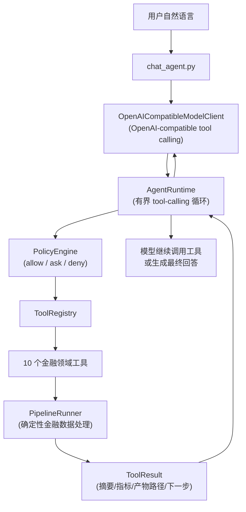

# Financial Table Workflow Agent

面向金融表格的数据准备、质量审计与受控修复工作流，并提供一个可运行的自然语言 Agent Demo。

用户通过自然语言要求 Agent 检查金融数据、生成建模宽表、执行质量验证、在必要时进行受控修复并生成报告。

> **这是一个可运行的 Agent Demo，不是生产级系统。** 当前实现把固定命令式 Pipeline 与模型驱动的 tool-calling Agent 结合在一起，用于演示"自然语言 → 自主工具调用 → 报告"的闭环。

---

## 1. 项目简介

把原始金融表格（行情、成交、财务、行业、交易日历）自动加工成一张干净的 **analysis-ready 建模宽表**，供下游建模使用。

- **只做数据准备**：不选股、不择时、不预测涨跌、不训练模型、不输出投资建议、不连接真实券商交易系统。
- **只使用真实市场数据**：合成样例数据及其自动生成逻辑已彻底移除；输入目录缺失时明确失败，绝不静默回退。
- **确定性 + 模型驱动**：金融数据处理由确定性 Pipeline 完成；LLM 只负责理解意图、选择工具、决定下一步。
- **独立数据源实现**：A 股行情、快照和行业查询由项目内置 `src/data_sources/astock.py`
  直接完成，不依赖或运行其他 Agent 项目。
- **来源与许可证透明**：相关解析代码的改造说明见 `NOTICE`，Apache 2.0 文本见
  `third_party/licenses/Apache-2.0.txt`。

---

## 2. 当前实现状态

项目已从固定命令式 Pipeline 发展为自然语言 Tool-Calling Agent。当前完成的核心能力：

- 确定性的金融数据处理 Pipeline（剖析 → 规划 → 执行 → 审查 → 修复 → 复审 → 报告）
- Agent Runtime 有界工具调用循环（`max_tool_turns` + 重复检测双保险）
- Tool Registry 与结构化 `ToolResult`（摘要 / 指标 / 产物路径 / 下一步建议）
- **11 个金融工作流领域工具**（含 `fetch_real_market_data`，见 [§5](#5-领域工具)）
- `run_id` 级别的运行产物隔离（`<output_base>/runs/<run_id>/`，路径穿越防护）
- PolicyEngine 的 `allow` / `ask` / `deny` 确定性权限审批
- guarded remediation 的人工审批与进程内恢复（`resume(ApprovalResponse)`）
- OpenAI-compatible Chat Completions 模型适配器
- 自然语言 CLI（`src/chat_agent.py`），支持两种模式：
  - **模式 A**：`--input_dir` 处理已有 CSV；
  - **模式 B**：不传 `--input_dir`，由模型从自然语言提取 tickers/日期，调用
    `fetch_real_market_data` 抓取真实数据到当前 run 的 `raw_data`，再走完整流程。
- **固定 Markdown 最终报告中文化**（`final_workflow_report.md` /
  `final_workflow_one_page.md`），含"数据来源与时间边界"章节。
- Fake Model 与真实模型接口的可测试设计（测试全 mock，不访问网络）

**开发状态**（简要，详见 `docs/`）：

| 阶段 | 内容 | 文档 |
|---|---|---|
| Stage 1–7 | 确定性 Pipeline + 一键运行 + Agent Shell | `docs/stage2`–`stage7` |
| Stage 8 | 真实 A 股数据适配器 | `docs/stage8_real_data_adapter.md` |
| Stage 9 | Agent Runtime MVP（tool-calling 骨架，Fake Model 驱动） | `docs/stage9_agent_runtime_mvp.md` |
| Stage 10 | PolicyEngine + 进程内审批恢复 | `docs/stage10_policy_and_approval.md` |
| Stage 11 | 自然语言 Agent Demo（真实 LLM + CLI） | `docs/stage11_natural_language_demo.md` |
| Stage 12 | 自然语言抓取真实数据 + 中文最终报告 | `docs/stage12_natural_language_data_fetch_and_chinese_report.md` |

---

## 3. 核心工作流

```
profile（剖析原始表格）
  → plan（按分析目标规划步骤与校验项）
  → prepare panel（执行生成 analysis-ready 宽表）
  → validate（初始有效性审查）
  → safe remediation（按需：仅当 validate 失败时）
  → validate repaired panel（对修复后宽表复审）
  → final report（汇总产物）
```

说明：

- **修复不是每次都执行**：`run_safe_remediation` 仅在初始审查返回 `failed` 时进入多轮修复；否则返回 `not_needed` 并生成 no-op 产物，直接进入复审与报告。
- **是否调用工具由模型决定**：模型根据 `ToolResult` 的 `next_actions` 与 `inspect_pipeline_status` 自主选择下一步，不盲目按固定顺序调用。
- **实际金融计算与文件写入由确定性 PipelineRunner 完成**：模型不直接改金融数据；工具只把 PipelineRunner 阶段包装成可调用接口。

---

## 4. Agent 架构



设计原则：

- **LLM 负责理解意图、选择工具和决定下一步**；不直接执行金融计算。
- **PipelineRunner 负责确定性的金融数据处理**；防未来函数、label 隔离、安全门均在其中。
- **Runtime 不直接调用 PipelineRunner**；只能通过 ToolRegistry 调用工具。
- **工具结果是 Agent 获取金融工作流状态的事实来源**；Runtime 不自行判断校验是否通过。
- **guarded 工具执行前经过审批策略**；`run_safe_remediation` 默认触发 `ASK`，需用户批准后才执行。

---

## 5. 领域工具

当前真实注册的 11 个工具（名称与 risk level 来自 `src/agent_tools/pipeline_tools.py`）：

| 工具名 | 主要用途 | risk level |
|---|---|---|
| `fetch_real_market_data` | Stage 0：自然语言抓取真实 A 股数据到当前 run 的 raw_data（模式 B） | guarded |
| `configure_workflow` | 校验输入目录、更新上下文、创建当前 run 的 runner（必须先有 input_dir） | workspace_write |
| `inspect_pipeline_status` | 只读当前 run 的阶段状态、校验状态、修复轮数、标签安全 | read |
| `profile_financial_data` | Stage 1：剖析原始 CSV（schema / 缺失 / 重复） | workspace_write |
| `create_workflow_plan` | Stage 2：按剖析结果与分析目标规划工作流 | workspace_write |
| `prepare_financial_panel` | Stage 3：执行生成 analysis-ready 宽表 | workspace_write |
| `validate_financial_panel` | Stage 4：初始有效性审查（未来函数 / label 泄漏） | workspace_write |
| `run_safe_remediation` | Stage 5：有界多轮修复（仅当初始审查失败；guarded） | guarded |
| `validate_repaired_panel` | Stage 6：对修复后宽表重新运行 Critic | workspace_write |
| `generate_workflow_report` | Stage 7：生成最终报告（只读前序产物） | workspace_write |
| `inspect_validation_failures` | 只读：结构化返回失败项 / 警告 / 建议 | read |

---

## 6. 快速开始

### 6.1 环境与依赖

- Python 3.10+（使用 `from __future__ import annotations` 等特性）
- 依赖仅 `pandas>=1.5.0` 与 `requests>=2.32.0`（见 `requirements.txt`）

```powershell
pip install -r requirements.txt
```

### 6.2 配置环境变量（自然语言 Demo 需真实 LLM）

API Key **只从环境变量读取**，不写入日志、事件或错误信息。`.env.example` 只含占位符，项目不自动读取 `.env`：

```powershell
$env:FTA_LLM_API_KEY = "your_api_key"
$env:FTA_LLM_BASE_URL = "https://your-provider.example/v1"
$env:FTA_LLM_MODEL = "your-model-name"
```

> 不得写入真实 API Key 到任何提交文件。`.env` 被 `.gitignore` 忽略。

### 6.3 运行测试

```powershell
python -B -m unittest discover -s tests -v
```

### 6.4 启动自然语言 Demo

**模式 A：处理已有 CSV**（用提交的小型真实 fixture，无需先抓数据）：

```powershell
python -B src/chat_agent.py `
  --input_dir test_data/real_market_sample `
  --output_base outputs_agent `
  --prompt "检查已有数据并生成中文报告" `
  --auto_approve_remediation
```

**模式 B：自然语言自动抓取真实数据**（只需网络，不依赖其他 Agent 项目）：

```powershell
python -B src/chat_agent.py `
  --output_base outputs_agent `
  --max_tool_turns 20 `
  --prompt "获取贵州茅台600519和平安银行000001从2024年1月1日至2024年6月30日的真实市场数据，不使用当前基本面快照，生成用于五日收益率研究的建模宽表，检查未来函数和标签泄漏，必要时安全修复，最后生成完整中文报告。" `
  --auto_approve_data_fetch `
  --auto_approve_remediation
```

> 模式 B 下，Agent 从自然语言提取 tickers / start_date / end_date，先调
> `fetch_real_market_data` 抓取到当前 run 的 `raw_data`，再走完整流程。自动测试全部
> mock 网络，不访问真实网络。

CLI 参数（与 `src/chat_agent.py` 的 argparse 一致）：

| 参数 | 默认 | 说明 |
|---|---|---|
| `--input_dir` | 无（模式 B） | 真实市场数据目录（模式 A）；不传则模式 B 由模型抓取 |
| `--output_base` | `outputs_real` | 产物根；每次 run 隔离在 `<base>/runs/<run_id>/` |
| `--run_id` | 自动生成 `run_<8hex>` | 可选 run id |
| `--prompt` | 从 stdin 读取 | 用户自然语言请求 |
| `--model` | 覆盖 `FTA_LLM_MODEL` | 模型名 |
| `--base_url` | 覆盖 `FTA_LLM_BASE_URL` | OpenAI-compatible base URL |
| `--max_tool_turns` | 12 | 模型工具调用轮上限（模式 B 建议 20） |
| `--auto_approve_remediation` | 关 | 只自动批准 `run_safe_remediation` |
| `--auto_approve_data_fetch` | 关 | 只自动批准 `fetch_real_market_data`（模式 B） |
| `--max_repair_rounds` | 3 | 透传给 PipelineRunner |
| `--max_row_loss_ratio` | 0.05 | 累计删行上限，超过转人工 |
| `--analysis_goal` | 默认 | 透传给 planner |

> **不使用 `--auto_approve_*` 时**，guarded 工具会请求用户确认（`Approve? [y/N]`）；输入 `y` 才执行。`--auto_approve_remediation` 只自动批准 `run_safe_remediation`，`--auto_approve_data_fetch` 只自动批准 `fetch_real_market_data`，两者互不越权。自动批准仍走 ASK 门，执行仍受内部安全门约束。

### 6.5 确定性 Pipeline 入口（无需 LLM）

```powershell
# 一键运行完整 Pipeline（推荐主入口；用于验证中文报告）
python -B src/run_all.py --input_dir test_data/real_market_sample --output_root outputs_chinese_report_smoke

# 交互式 Agent Shell（固定命令模式）
python -B src/agent_shell.py --input_dir test_data/real_market_sample --output_root outputs_real
```

---

## 7. 输出产物

每次运行隔离在 `<output_base>/runs/<run_id>/` 下（`run_id` 由 `AgentContext` 规范化，路径穿越防护）。`run_root` 内目录与文件名以 `pipeline_runner.py` 路径常量为准：

| 目录 | 关键产物 | 产生阶段 |
|---|---|---|
| `profiles/` | `profile.json` / `profile_report.md` | Stage 1 |
| `plans/` | `workflow_plan.json` / `workflow_plan_report.md` | Stage 2 |
| `prepared/` | `prepared_panel.csv` / `data_dictionary.json` / `execution_log.json` / `execution_report.md` | Stage 3 |
| `validation/` | `validation_report.json` / `validation_report.md` / `approved_feature_columns.json` | Stage 4 |
| `repaired/` | `repair_plan.json` / `repaired_panel.csv` / `repair_log.json` / `repair_report.md` / `repair_history.json` | Stage 5 |
| `validation_repaired/` | 复审 Critic 产物 | Stage 6 |
| `final_report/` | `final_workflow_summary.json` / `final_workflow_report.md` / `final_workflow_one_page.md` / `pipeline_artifacts_index.json` | Stage 7 |
| `sessions/` | `latest_session.json` / `session_*.json` | Stage 7 |

> `repair_history.json` 即使 blocked / failed / 异常也保存，保证审计文件始终存在。
> `data/real_market/` 与 `outputs_real/` 均被 `.gitignore` 忽略，运行时生成；唯一提交的真实数据是 `test_data/real_market_sample/` 下的小型 fixture。

---

## 8. 测试

```powershell
python -B -m unittest discover -s tests -v
```

实际运行结果：**199 项测试全部通过**（`Ran 199 tests ... OK`）。主要覆盖范围：

- Pipeline 各阶段与 Remediation Agent 多轮闭环
- ToolRegistry + JSON Schema 校验
- `run_id` 隔离与路径穿越防护
- Agent Runtime tool-calling 循环与停止条件
- PolicyEngine 决策与优先级
- 审批暂停 / 恢复（防篡改、防跨 run、防重放、多 ToolCall 恢复）
- OpenAI-compatible 消息 / 工具 schema 转换与错误处理
- `chat_agent` CLI（参数、缺配置、Fake Model 全链、审批、输出路径、不访问网络）
- **Stage 12**：`fetch_real_market_data` 工具（注册、ticker/日期/数量校验、raw_data
  隔离、产物不逃出 run_root、fetch 后更新 input_dir、全失败/部分失败、mock adapter）、
  模式 B 自然语言抓取完整链路（Fake Model + mock fetch）、按工具名分别自动批准、
  无 input_dir 启动与 PRECONDITION_NOT_MET、中文最终报告（标题、数值来自产物、
  summary.json 兼容、label 不进 approved、数据来源章节）。

测试全部不访问网络、不依赖真实 LLM、不修改被提交的真实 fixture（故障注入到临时副本；
抓取测试 mock `real_data_adapter.fetch_real_data`）。

---

## 9. 项目结构

简化目录树（完整结构、模块职责、调用链见 [CODE_STRUCTURE.md](CODE_STRUCTURE.md)）：

```
financial_table_workflow_agent_v3/
├── src/                  # 运行代码（Pipeline 阶段 + CLI + Agent Runtime + 领域工具）
│   ├── data_sources/     # 项目内置 A 股 HTTP 数据源（东方财富/腾讯/新浪）
│   ├── agent_runtime/    # Agent Runtime（models/context/registry/policy/runtime + 模型适配器）
│   ├── agent_tools/      # 11 个金融领域工具（含 fetch_real_market_data）
│   ├── chat_agent.py     # 自然语言 Agent CLI（模式 A 已有 CSV / 模式 B 自然语言抓取）
│   ├── pipeline_runner.py
│   └── ...               # 各阶段模块与 CLI
├── tests/                # 199 项 unittest
├── test_data/real_market_sample/  # 小型真实 fixture（提交 Git）
├── docs/                 # 分阶段设计文档（stage2–stage12）
├── prompts/              # system prompt 与 planner prompt 模板
├── .env.example          # 环境变量占位符
└── requirements.txt      # pandas + requests
```

---

## 10. 已知限制

- **只适配 OpenAI-compatible Chat Completions tool calling**；实际 provider 兼容性仍取决于具体服务端实现。
- **session 与 pending approval 只存在于当前进程**；进程退出即丢失 Runtime 状态。
- **暂未实现跨进程 session persistence**（pending approval / 事件流不落盘）。
- **不包含 MCP、多 Agent 或插件系统**。
- **不是生产级安全系统**：审批是进程内交互；API Key 由调用方负责保管。
- **不记录或暴露模型隐藏推理**；只记录用户输入、工具调用、工具结果、最终文本。
- **模式 B 真实抓取需要网络**；数据源实现位于本项目内部，自动测试全部 mock，
  不访问真实网络。流水线处理本身离线可运行。
- **当前 PE/PB/ROE 是快照，不是历史 point-in-time 基本面**，不回填到历史日期。

---

## 11. 后续方向

- session persistence（`AgentRunResult` + 事件流 + pending approval 落盘，跨进程恢复）
- 更完善的运行事件与可观测性
- 更多模型 provider 适配器
- Web UI
- 多数据源与更多金融工作流工具

> 以上均为后续方向，**当前未实现**，不描述为已完成。
