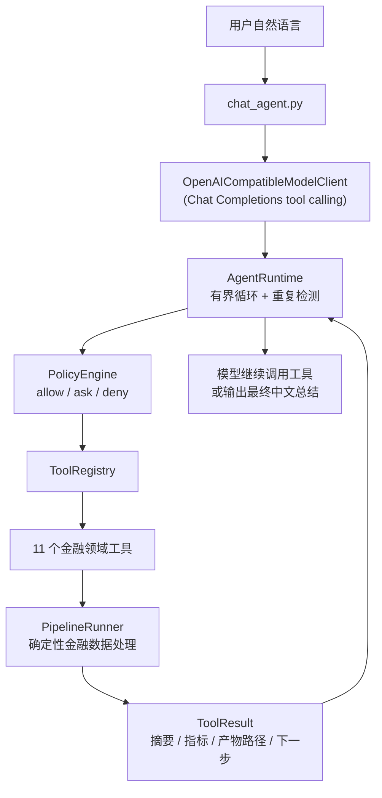

# LLM Agent 指南

> **自然语言 → 模型自主调用工具 → analysis-ready 宽表 + 中文报告。**
>
> 本文是 LLM Agent 部分的唯一主文档：架构、工具、运行、审批、排查、验收都在这里。
> 不调 LLM 的确定性 Pipeline 见 [PIPELINE.md](PIPELINE.md)；代码地图见 [../CODE_STRUCTURE.md](../CODE_STRUCTURE.md)。
>
> 本文以**源码实际实现**为准，不描述未实现的功能。命令可在 PowerShell 直接复制运行（续行为反引号 `` ` ``）。

---

## 1. 一分钟看懂

用户发一句中文，LLM 自主选择并调用 11 个金融领域工具，把原始行情/成交/财务/行业/日历表格加工成一张
**analysis-ready 建模宽表**，并产出中文报告。

**最重要的一条设计：LLM 决策，确定性代码执行。**

| 组件 | 负责 | **不**负责 |
|---|---|---|
| **LLM** | 理解意图、选择工具、决定下一步、解释结果 | 不做金融计算、不改数据、不判断校验是否通过 |
| **PipelineRunner**（确定性 Python） | 全部金融计算、防未来函数、label 隔离、修复安全门 | 不做决策 |
| **PolicyEngine**（确定性） | 每次工具执行**前**的 allow / ask / deny | 不调模型；模型和用户文本无法自行授权 |
| **AgentRuntime** | 有界 tool-calling 循环、事件、暂停/恢复 | 不直接调 PipelineRunner，只能经 ToolRegistry |

由此得到两条硬边界：

- **模型不直接碰金融数据**——工具只是把 PipelineRunner 的阶段包装成可调用接口。
- **工具结果是 Agent 感知状态的唯一事实来源**——Runtime 不自行判断校验是否通过。



**不做的事**：不选股、不择时、不预测涨跌、不输出投资建议、不连接券商交易系统。

---

## 2. 五分钟跑起来

### 2.1 前提

- Python 3.10+
- `pip install -r requirements.txt`（只有 `pandas>=1.5.0` 和 `requests>=2.32.0`）

### 2.2 配置 LLM（三个环境变量）

API Key **只从环境变量读取**，不写入仓库、日志、事件或错误信息。项目**不自动读取 `.env`**；
`.env.example` 只含占位符，`.env` 被 `.gitignore` 忽略。

```powershell
$env:FTA_LLM_API_KEY = "your_api_key"          # 只进 HTTP Authorization: Bearer 头
$env:FTA_LLM_BASE_URL = "https://your-provider.example/v1"
$env:FTA_LLM_MODEL = "your-model-name"          # 必须支持 tool calling
```

验证配置就绪（三项均非空即可）：

```powershell
python -c "import os; print('KEY:', bool(os.environ.get('FTA_LLM_API_KEY')), '| URL:', os.environ.get('FTA_LLM_BASE_URL'), '| MODEL:', os.environ.get('FTA_LLM_MODEL'))"
```

任一缺失时 `chat_agent.py` 以退出码 1 报 `model not configured`。

### 2.3 模式 A：处理已有 CSV（无需网络，用提交的小型真实 fixture）

```powershell
python -B src/chat_agent.py `
  --input_dir test_data/real_market_sample `
  --output_base outputs_agent `
  --prompt "检查已有数据并生成中文报告" `
  --auto_approve_remediation
```

### 2.4 模式 B：自然语言自动抓取真实数据（需网络）

```powershell
python -B src/chat_agent.py `
  --output_base outputs_agent `
  --max_tool_turns 20 `
  --prompt "获取贵州茅台600519和平安银行000001从2024年1月1日至2024年6月30日的真实市场数据，不使用当前基本面快照，生成用于五日收益率研究的建模宽表，检查未来函数和标签泄漏，必要时安全修复，最后生成完整中文报告。" `
  --auto_approve_data_fetch `
  --auto_approve_remediation
```

终端末尾会打印 `Run root:` 与 `Final report:` 路径。

---

## 3. 两种工作模式

区别只在**有没有 `--input_dir`**：

| 模式 | 触发 | 工具链 |
|---|---|---|
| **A** 已有 CSV | 传 `--input_dir` | `configure → profile → plan → prepare → validate → inspect failures → remediation → revalidate → report` |
| **B** 自然语言抓取 | **不**传 `--input_dir` | `fetch_real_market_data → ` 同上 |

模式 B 下：AgentContext 以"无 input_dir"状态启动 → 模型从自然语言提取 tickers / start_date / end_date
→ `fetch_real_market_data` 抓到当前 run 的 `raw_data/` → `set_input_dir(raw_data)` → `configure_workflow`
用它创建 PipelineRunner。

> **绝不静默回退**：缺输入时明确失败，不会偷偷用 fixture 或合成数据顶替。

模式 A 完全向后兼容，两种模式互不破坏。

---

## 4. 11 个领域工具

来自 `src/agent_tools/pipeline_tools.py` 的 `build_default_registry_specs()`。risk level 决定审批行为（见 §6）。

| 工具 | 用途 | risk level |
|---|---|---|
| `fetch_real_market_data` | 模式 B：抓真实 A 股数据到当前 run 的 `raw_data` | **guarded** |
| `configure_workflow` | 校验输入目录、更新上下文、创建当前 run 的 runner | workspace_write |
| `inspect_pipeline_status` | 只读：阶段状态、校验状态、修复轮数、标签安全 | read |
| `profile_financial_data` | Stage 1：剖析原始 CSV（schema / 缺失 / 重复） | workspace_write |
| `create_workflow_plan` | Stage 2：按剖析结果与分析目标规划 | workspace_write |
| `prepare_financial_panel` | Stage 3：生成 analysis-ready 宽表 | workspace_write |
| `validate_financial_panel` | Stage 4：初始有效性审查（未来函数 / label 泄漏） | workspace_write |
| `run_safe_remediation` | Stage 5：有界多轮修复（仅当初始审查 failed） | **guarded** |
| `validate_repaired_panel` | Stage 6：对修复后宽表复审 | workspace_write |
| `generate_workflow_report` | Stage 7：生成最终报告（只读前序产物） | workspace_write |
| `inspect_validation_failures` | 只读：结构化返回失败项 / 警告 / 建议 | read |

**工具包装的硬性约束**（已在代码中落实）：

- 优先调 PipelineRunner 公开方法，不复制业务代码。
- `ToolResult` 里**不放**完整 CSV / 报告 / DataFrame，只放摘要、指标、产物路径、`next_actions`。
- 产物路径必须属于当前 `run_root`。
- stage `status=failed` → `ToolResult.ok=False`；`manual_review_required` → `requires_user_action=True`。
- 检测到 label 进入 approved features → 返回 `LABEL_LEAKAGE_DETECTED` 并转人工。

### `run_safe_remediation` 的语义

**不是每次都修**：只在初始 critic 为 `failed` 时进入多轮 Remediation Agent；已 `passed` / `passed_with_warnings`
时返回 `not_needed` 并生成 no-op 产物，直接进入复审与报告。它委托 PipelineRunner 的公开方法，不重写修复策略、
不绕过安全门。

### `fetch_real_market_data` 的参数与校验

输入 schema：

```json
{
  "tickers": {"type": "array", "items": {"type": "string"}},
  "start_date": {"type": "string"},
  "end_date": {"type": "string"},
  "snapshot_fundamentals": {"type": "boolean"}
}
```

system prompt 要求模型提取 tickers / start_date / end_date，**缺关键参数时不猜测**，改用最终文本要求用户补充。
但真正的把关在**工具层代码**，不依赖模型自觉：

- ticker 必须 6 位数字（可带 SH/SZ/BJ 前后缀），否则 `INVALID_TOOL_ARGUMENTS`。
- 日期必须 `YYYY-MM-DD` 且为真实日历日期；要求 `start_date <= end_date`。
- 单次 ticker 上限 20（`MAX_FETCH_TICKERS`），防止模型发起超大抓取。
- `snapshot_fundamentals` **默认 false**——当前 PE/PB/ROE 是快照，不是历史 point-in-time 基本面，
  不能回填到历史日期（否则引入未来信息泄漏）。

> registry 的基础 schema 校验不支持 `minItems` / `maximum` 等高级关键字，这些约束在 handler 内以代码实现。

失败处理：全部 ticker 失败或 `price.csv` 为空 → 结构化失败 `FETCH_NO_USABLE_DATA`，**不**更新 `input_dir`，
不进入后续流程；部分 ticker 失败 → 保留成功结果，在 `warnings` / `errors` 记录，继续流程。

---

## 5. Runtime：有界 tool-calling 循环

`src/agent_runtime/runtime.py`。循环：追加用户消息 → 调模型 → 返回 `final_text` 则结束；返回 `tool_calls`
则**顺序执行（不并行）** → 结构化结果回填下一轮 messages → 继续，直到命中停止条件。

**停止条件**（`StopReason`）：

| stop_reason | 触发 |
|---|---|
| `completed` | 模型返回 `final_text` |
| `max_tool_turns` | 达到上限（默认 12；模式 B 建议 20） |
| `repeated_tool_call` | 连续两轮相同工具名 + 规范化参数 |
| `awaiting_approval` | PolicyEngine 判定 ASK，等待用户批准 |
| `requires_user_action` | 工具返回 `requires_user_action=True`（如 manual_review_required） |
| `model_protocol_error` | `final_text` 与 `tool_calls` 同时为空或同时非空 |
| `runtime_error` | Runtime 内部不可恢复错误（兜底） |

**防失控双保险**：`max_tool_turns` + 重复调用检测。另外 Runtime 不记录或输出模型隐藏推理，只记录
用户输入、工具调用、工具结果、最终文本。

### run_id 产物隔离

每次运行隔离在 `<output_base>/runs/<run_id>/`：

- `run_id` 必须匹配 `^[A-Za-z0-9][A-Za-z0-9_-]*$`，禁止 `..` / `/` / `\`（**路径穿越防护**）。
- `run_root` 严格位于 `output_base/runs/<run_id>`（resolve 后用 `relative_to` 校验）。
- 工具只写当前 `run_root`，**不覆盖原始输入 CSV**，不跨 run 读写。

---

## 6. 审批与安全门

这是本项目最需要讲清楚的一块：**两层防线，且第二层不可被第一层绕过。**

### 6.1 第一层：PolicyEngine（执行前，决定"要不要执行"）

`src/agent_runtime/policy.py`。完全确定性——相同 `(tool_name, risk_level)` 永远得到相同决策，
不调模型、不做 IO、不读墙钟。**模型和用户文本不能修改策略或声称"已授权"**，策略只能由代码在构造时确定。

默认策略（`PolicyConfig.default()`）与决策优先级：

| risk level | 默认动作 |   | 优先级（从高到低） |
|---|---|---|---|
| `read` | ALLOW |   | 1. 工具级 DENY |
| `workspace_write` | ALLOW |   | 2. 工具级 ASK |
| `guarded` | **ASK** |   | 3. 工具级 ALLOW |
| 未知 | DENY（兜底） |   | 4. risk 默认策略 → 5. 默认 DENY |

三种动作的行为：

- **ALLOW**：记录 `policy_decision` 事件并执行 handler。
- **ASK**：**不执行 handler**，创建 `PendingApproval` 并暂停，返回 `awaiting_approval`。
- **DENY**：**不执行 handler**，回填结构化拒绝 `TOOL_DENIED_BY_POLICY`（`retryable=False`），让模型另选方案。
  DENY 不中断同一轮的后续调用。

### 6.2 暂停 / 恢复与防篡改

`AgentRuntime.resume(ApprovalResponse)` 的校验，任一失败即拒绝且**保留 pending 不消费**：

| 校验 | 失败 outcome | 防的是 |
|---|---|---|
| 当前必须有 pending | `no_pending` | **重放**（二次 resume） |
| `request_id` 匹配 | `rejected_wrong_id` | 错配 |
| `pending.run_id == context.run_id` | `rejected_cross_run` | **跨 run** |
| `fingerprint` 匹配 | `rejected_tampered` | **参数篡改** |

fingerprint 至少含 tool name + arguments + run_id（`json.dumps(sort_keys=True)`，参数顺序不影响）。
校验通过后**一次性消费** pending：approved 则执行原 ToolCall **恰一次**；rejected 则回填
`TOOL_REJECTED_BY_USER` 且**不执行**。resume **不重置** `max_tool_turns` 与重复检测状态。

多 ToolCall 时：遇第一个 ASK 暂停并记住位置，resume 后从下一个继续，不丢失、不重复。

> **`awaiting_approval` 与 `requires_user_action` 不是一回事**：前者在工具执行**前**（handler 未跑，
> 用 `resume()` 恢复）；后者在工具执行**后**（handler 已跑，需人工处理后重新 `run()`）。

### 6.3 CLI 审批：按工具名分别授权

不传 flag 时交互式确认：

```text
Agent requests:
  fetch_real_market_data
  arguments: {'tickers': ['600519'], 'start_date': '2024-01-01', 'end_date': '2024-01-10'}
Approve? [y/N]
```

输入 `y` / `yes` 才执行；其他或回车 → 拒绝。

| 工具 | 自动批准 flag |
|---|---|
| `fetch_real_market_data` | `--auto_approve_data_fetch` |
| `run_safe_remediation` | `--auto_approve_remediation` |
| 其他 guarded | 无，只能交互式确认 |

**两个 flag 互不越权**：`--auto_approve_remediation` 不会批准 fetch，反之亦然。自动批准仍走 ASK 门，
执行仍受下面的安全门约束。

### 6.4 第二层：金融安全门（执行时，审批**不能**绕过）

审批只决定"是否执行"；执行仍走 PipelineRunner → Remediation Agent，内部安全门照常生效：

| 安全门 | 默认 | 作用 |
|---|---|---|
| `max_repair_rounds` | 3 | 修复最大轮数 |
| `max_row_loss_ratio` | 0.05（5%） | 累计删行上限，超过转人工 |
| `no_progress` | — | failed 集合 + panel 指纹连续不变 → 停止，禁止无限循环 |
| `manual_review_required` | — | 安全门超限或无法收敛 → `requires_user_action=True`，Runtime 停止 |
| label 隔离 | — | `label_next_5d` **永不**进入 `approved_feature_columns`；检测到泄漏返回 `LABEL_LEAKAGE_DETECTED` |

有测试专门盯这条（`test_approval_does_not_bypass_safety_gate`）：注入 14% 删行需求（> 5% 门），
即使批准 `run_safe_remediation`，执行仍触发 `manual_review_required`，未被绕过。

---

## 7. 输出产物

每次运行隔离在 `<output_base>/runs/<run_id>/`。目录与文件名以 `pipeline_runner.py` 的路径常量为准。

| 目录 | 关键产物 | 阶段 |
|---|---|---|
| `raw_data/` | 五张 CSV + `fetch_metadata.json`（**仅模式 B**） | fetch |
| `profiles/` | `profile.json` / `profile_report.md` | 1 |
| `plans/` | `workflow_plan.json` / `workflow_plan_report.md` | 2 |
| `prepared/` | `prepared_panel.csv` / `data_dictionary.json` / `execution_log.json` / `execution_report.md` | 3 |
| `validation/` | `validation_report.json` / `.md` / `approved_feature_columns.json` | 4 |
| `repaired/` | `repair_plan.json` / `repaired_panel.csv` / `repair_log.json` / `repair_report.md` / `repair_history.json` | 5 |
| `validation_repaired/` | 复审 Critic 产物 | 6 |
| `final_report/` | `final_workflow_summary.json` / `final_workflow_report.md` / `final_workflow_one_page.md` / `pipeline_artifacts_index.json` | 7 |
| `sessions/` | `latest_session.json` / `session_*.json` | 7 |

> `repair_history.json` 即使 blocked / failed / 异常也保存，保证审计文件始终存在。

**怎么读**：

- `prepared_panel.csv` / `repaired_panel.csv`——修复前/后的建模宽表。
- `approved_feature_columns.json`——approved 特征列 + `label_column`；`label_next_5d` 不在其中。
- `fetch_metadata.json`（模式 B）——可审计的抓取元数据：tickers、日期、来源、行数、基本面限制、warnings/errors。
- `final_workflow_summary.json`——机器可读汇总（`initial_validation_status` / `final_validation_status` /
  `rows_removed_by_repair` / `closed_loop_result` / `data_source_summary` 等）。
- `final_workflow_report.md` / `final_workflow_one_page.md`——中文人类可读报告，含"数据来源与时间边界"章节。

```powershell
# 查看最终报告（必须用 UTF-8，否则中文乱码）
Get-Content outputs_agent\runs\<run_id>\final_report\final_workflow_report.md -Encoding utf8
```

---

## 8. CLI 参数

与 `src/chat_agent.py` 的 argparse 一致：

| 参数 | 默认 | 说明 |
|---|---|---|
| `--input_dir` | 无 → **模式 B** | 传则模式 A |
| `--output_base` | `outputs_real` | 产物根，每次 run 隔离在 `<base>/runs/<run_id>/` |
| `--run_id` | 自动 `run_<8hex>` | 可选 |
| `--prompt` | 从 stdin 读 | 用户自然语言请求 |
| `--model` | 覆盖 `FTA_LLM_MODEL` | 模型名 |
| `--base_url` | 覆盖 `FTA_LLM_BASE_URL` | OpenAI-compatible base URL |
| `--max_tool_turns` | 12 | 工具调用轮上限（模式 B 建议 20） |
| `--auto_approve_remediation` | 关 | 只自动批准 `run_safe_remediation` |
| `--auto_approve_data_fetch` | 关 | 只自动批准 `fetch_real_market_data` |
| `--max_repair_rounds` | 3 | 透传 PipelineRunner |
| `--max_row_loss_ratio` | 0.05 | 累计删行上限 |
| `--analysis_goal` | 默认值 | 透传 planner |

**退出码**（`$LASTEXITCODE` 查看）：

| 码 | 含义 |
|---|---|
| 0 | 模型返回 `final_text`，正常完成 |
| 1 | 配置/运行错误（LLM 未配置、input_dir 非法、runtime 异常） |
| 2 | 需人工介入（`manual_review_required` / `requires_user_action` / 审批被拒后模型未完成） |

---

## 9. 数据源（模式 B）

模式 B 直接用项目内置的 `src/data_sources/astock.py`，**不加载、不调用另一个 Agent 项目**：

- 日线行情：东方财富为主，新浪为 fallback。
- 当前 PE/PB 快照：腾讯（仅 `snapshot_fundamentals=true`）。
- 行业：东方财富。
- 缓存：自然语言 Agent 固定用 `<run_root>/raw_data/cache/`，与其他 run 隔离；CLI 抓取默认 `<output_dir>/cache/`。
- LLM **不能**控制数据源模块或任意文件系统路径。

需要访问的域名：`push2his.eastmoney.com`（东财日线）、`push2.eastmoney.com`（东财行业）、
`money.finance.sina.com.cn`（新浪 fallback）、`qt.gtimg.cn`（腾讯快照）。

> 部分 ticker 规范化、腾讯响应解析与新浪 fallback 逻辑改造自 Apache-2.0 项目 TradingAgents-Astock，
> 归属与改造说明见 [`NOTICE`](../NOTICE)，许可证见 `third_party/licenses/Apache-2.0.txt`。

可先跑一个最小抓取验证网络：

```powershell
python -B src/run_fetch_real_data.py `
  --tickers 600519 --start_date 2024-01-01 --end_date 2024-01-10 `
  --output_dir outputs_real/smoke --no_snapshot_fundamentals
```

成功时出现五张 CSV + `fetch_metadata.json`，其中 `data_provider` 应为 `project_internal_astock_http`。

---

## 10. 测试

```powershell
python -B -m unittest discover -s tests -v
```

**实际结果：201 项全部通过**（`Ran 201 tests ... OK`）。测试**不访问网络、不依赖真实 LLM、
不修改被提交的 fixture**（故障注入到临时副本；抓取测试 mock `real_data_adapter.fetch_real_data`）。

Agent 相关的关键测试文件：

| 文件 | 覆盖 |
|---|---|
| `test_agent_runtime.py` | tool-calling 循环、停止条件、run_id 隔离、Runtime 不直接依赖 PipelineRunner（含 `ScriptedFakeModel`） |
| `test_tool_registry.py` | ToolRegistry + JSON Schema 校验 |
| `test_policy_engine.py` | PolicyEngine 决策与优先级 |
| `test_runtime_approval.py` | 审批暂停/恢复、防篡改/防跨 run/防重放、多 ToolCall 恢复、**安全门不被绕过** |
| `test_openai_compatible_client.py` | 协议转换、错误处理、API Key 脱敏（全 mock） |
| `test_chat_agent.py` | CLI 参数、模式 A/B 全链、按工具名审批、无 input_dir → `PRECONDITION_NOT_MET` |
| `test_fetch_tool.py` | fetch 工具注册、ticker/日期/数量校验、raw_data 隔离、产物不逃出 run_root、全失败/部分失败 |
| `test_pipeline_tools.py` | 11 个工具输入校验、不生成合成数据、stage 失败传递、label 不进 features |
| `test_chinese_report.py` | 中文报告标题、数值来自真实产物、summary.json 兼容、数据来源章节 |
| `test_astock_data_source.py` | 内置数据源解析、HTTP 回退、run-local 缓存、与外部 Agent 依赖隔离 |

---

## 11. 故障排查

| 现象 | 原因 | 处理 |
|---|---|---|
| `model not configured`（退出码 1） | 三个 `FTA_LLM_*` 任一未设 | 按 §2.2 设置；**环境变量仅当前 PowerShell 会话有效**，新窗口需重设 |
| `PRECONDITION_NOT_MET` | 模式 B 下 fetch 成功前就调 profile；或 `input_dir` 未配置就 configure | **预期行为**。工具会建议先 `fetch_real_market_data`，模型应自行纠正；反复出错则加大 `--max_tool_turns` 或换更强的模型 |
| `FETCH_NO_USABLE_DATA` | 全部 ticker 失败或 `price.csv` 为空 | 查网络、ticker（6 位数字）、日期区间是否含交易日；细节见 `raw_data/fetch_metadata.json` 的 `errors` / `per_ticker_errors` |
| 抓取 HTTP 失败 | 网络策略 / 接口临时不可用 / 响应格式异常 | 按 §9 检查域名可达性，再跑最小抓取 |
| `max_tool_turns` 停止 | 轮数达上限（默认 12） | 模式 B 用 `--max_tool_turns 20` |
| `manual_review_required`（退出码 2） | 删行 > 5%、`no_progress`、标签泄漏、空 panel | **这是安全停止，不是 bug**。看 `repaired/repair_history.json` 与 `validation_repaired/validation_report.json`。可放宽 `--max_row_loss_ratio`（如 0.5）后重跑，但需理解其含义 |
| 审批拒绝后停止 | 对 guarded 工具输入了 `n` | 预期行为。模型收到 `TOOL_REJECTED_BY_USER`，应另选方案或给最终总结 |
| 中文报告乱码 | 用了非 UTF-8 工具查看 | `Get-Content -Encoding utf8` 或用 VS Code |
| 测试失败 | 环境问题或代码被改 | 确认依赖装好、Python 3.10+、fixture 未改（`git diff --stat test_data/` 应为空） |

---

## 12. 已知限制（明确声明，不描述为已实现）

- **只适配 OpenAI-compatible Chat Completions tool calling**；实际兼容性仍取决于具体服务端实现。
- **session 与 pending approval 只存在于当前进程**；进程退出即丢失 Runtime 状态（事件流不落盘）。
- **未实现跨进程 session persistence**。
- **不包含 MCP、多 Agent 或插件系统**。
- **不是生产级安全系统**：审批是进程内交互；API Key 由调用方保管。
- **不记录或暴露模型隐藏推理**。
- **模式 B 需要网络**；自动测试全部 mock。Pipeline 处理本身离线可运行。
- **当前 PE/PB/ROE 是快照，不是历史 point-in-time 基本面**，不回填到历史日期。

后续方向（**当前未实现**）：session 持久化、更完善的运行事件与可观测性、更多 provider 适配器、
流式输出/重试/限流、更细粒度 PolicyEngine、Web UI。

---

## 13. 验收清单

按顺序执行，全部通过即验收完成。

**环境**
- [ ] `python --version` ≥ 3.10
- [ ] `pip install -r requirements.txt`
- [ ] 三个 `FTA_LLM_*` 已设置（§2.2 验证命令）
- [ ] （模式 B）§9 的最小抓取成功

**测试**
- [ ] `python -B -m unittest discover -s tests -v` 末尾 `OK`（201 项）
- [ ] `git diff --stat test_data/` 为空（fixture 未被修改）

**确定性 Pipeline（无需 LLM）** — 详见 [PIPELINE.md](PIPELINE.md)
- [ ] `python -B src/run_all.py --input_dir test_data/real_market_sample --output_root outputs_chinese_report_smoke` 退出码 0
- [ ] `final_workflow_report.md` / `final_workflow_one_page.md` 为中文
- [ ] `final_workflow_summary.json` 可解析
- [ ] `label_next_5d` 不在 approved features 中
- [ ] 报告含"数据来源与时间边界"章节

**LLM Agent 模式 A**
- [ ] §2.3 命令退出码 0
- [ ] 终端打印 `Run root:` 与 `Final report:`
- [ ] 报告存在且为中文，模型最终回答为中文

**LLM Agent 模式 B（需网络）**
- [ ] §2.4 命令退出码 0
- [ ] 终端出现 `[tool] fetch_real_market_data ... completed`
- [ ] `run_root/raw_data/` 下有五张 CSV + `fetch_metadata.json`
- [ ] 报告"数据来源与时间边界"章节显示抓取来源（tickers、日期、行数）

**审批机制（可选但建议）**
- [ ] 不传 `--auto_approve_data_fetch` 跑模式 B，出现 `Approve? [y/N]`
- [ ] 输入 `n` → fetch 不执行，模型给出最终文本
- [ ] 输入 `y` → fetch 执行一次

**清理**
- [ ] 撤销一次性 API Key
- [ ] 确认无真实 Key 被提交

---

## 14. 一页速查

```powershell
# 配置
$env:FTA_LLM_API_KEY = "..."; $env:FTA_LLM_BASE_URL = "..."; $env:FTA_LLM_MODEL = "..."

# 测试（201 项，不联网）
python -B -m unittest discover -s tests -v

# 确定性 Pipeline（无需 LLM）
python -B src/run_all.py --input_dir test_data/real_market_sample --output_root outputs_chinese_report_smoke

# 模式 A（已有 CSV，需 LLM）
python -B src/chat_agent.py --input_dir test_data/real_market_sample --output_base outputs_agent `
  --prompt "检查已有数据并生成中文报告" --auto_approve_remediation

# 模式 B（自然语言抓取，需 LLM + 网络）
python -B src/chat_agent.py --output_base outputs_agent --max_tool_turns 20 `
  --prompt "获取600519从2024年1月1日至2024年6月30日的真实市场数据，生成建模宽表并输出中文报告" `
  --auto_approve_data_fetch --auto_approve_remediation
```

---

> 分阶段的开发过程记录（Stage 9 Runtime MVP、Stage 10 PolicyEngine、Stage 11 自然语言 Demo、
> Stage 12 抓取 + 中文报告）已归档在 [archive/](archive/)，其内容已合并入本文。
