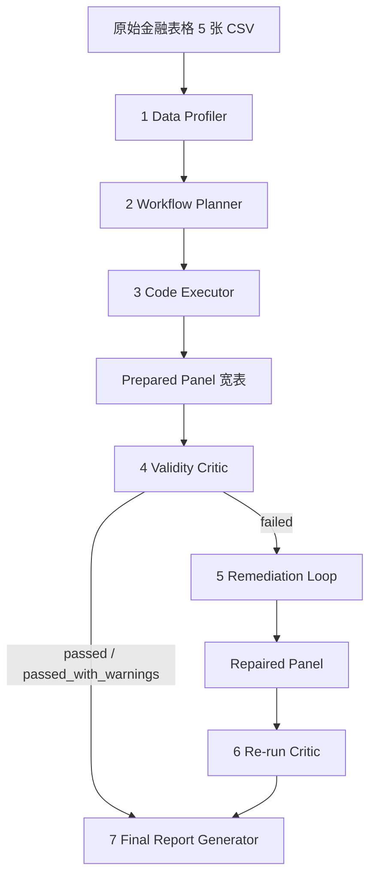

# 确定性 Pipeline 指南

> 七阶段金融表格数据准备工作流：**剖析 → 规划 → 执行 → 审查 →（按需）修复 → 复审 → 报告**。
> 全程确定性 Python，**不调用任何 LLM**，可离线运行（抓取数据除外）。
>
> LLM Agent 如何驱动这条流水线见 [LLM_AGENT.md](LLM_AGENT.md)；代码地图见 [../CODE_STRUCTURE.md](../CODE_STRUCTURE.md)。

---

## 1. 要解决的问题

原始金融表格通常不能直接拿去建模。常见问题分两类：

**普通数据质量问题**（必要但不充分）

- 字段名不一致：行情表 `trade_date` vs 成交量表 `date`；`ticker` vs `stock_code`。
- 缺失值、重复主键（同一 `(date, ticker)` 多行，join 后膨胀行数、错位标签）。
- 跨表 schema mismatch、日期口径不一致（交易日/非交易日混杂、停牌缺失）。

**有效性问题**（真正致命，普通检查覆盖不到）

- **look-ahead bias（未来函数）**：rolling / pct_change 窗口或财务对齐用到了预测时点之后的数据。回测极好，实盘崩盘。
- **label leakage**：把未来收益标签当成特征，训练准确率近 100% 但完全无效。
- **财务数据时间可得性**：`report_date`（季报截止日）通常要到 `announce_date`（公告日）才披露。
  按 `report_date` 对齐 = 用了未来才知道的信息。
- **rolling window 跨标的泄漏**：未按 ticker 分组，或窗口方向错误。

交付物是**一张干净的、可安全建模的宽表 + 全流程审计产物**，不是预测模型，也不是投资建议。

---

## 2. 为什么不只是"表格检查"

普通表格检查问"数据干不干净"；本工作流问的是更难、task-aware 的问题：
**这份数据能不能安全地喂给一个时间序列模型而不泄漏未来？**

| 维度 | 普通表格检查 | 本工作流 |
|---|---|---|
| 关注点 | 缺失 / 重复 / dtype / 异常 | 未来函数、标签泄漏、时间有效性 |
| 失败后果 | 表脏但可清洗 | 模型看似有效实则无效，实盘灾难 |
| 检查对象 | 表本身 | 表 + 数据字典 + 执行日志 + plan + **源码** |
| 判定依据 | 统计阈值 | 时间因果性、role 标注、源码静态分析 |
| 失败时 | 报告并停止 | **修复 → 再审查闭环** |

具体落在六点：

1. **task-aware 规划**：Planner 读 profile + 下游分析目标，输出有序、依赖明确、每步标注泄漏风险的计划。
2. **未来函数构造性预防**：rolling / pct_change 按 ticker 分组只用历史窗口；财务按 `announce_date`
   做 as-of 对齐，**绝不**用 `report_date`。
3. **标签泄漏预防**：`label_next_5d` 用 `shift(-5)` 生成并标注 `role=label`，**结构性**排除出
   `approved_feature_columns`——不是靠约定，是靠数据结构。
4. **时间有效性**：plan 要求 time-based train/test 切分，Critic 强制检查。
5. **源码级静态分析**：Critic 读 `executor.py` 源码，验证确实用了 `merge_asof` + `announce_date`，
   且不存在非 label 的 `shift(-k)`。
6. **闭环自我修正**：Critic failed → Repair → 由**独立**的 Critic 复审，而非自证修好。

---

## 3. 七个阶段



| # | 阶段 | 输入 | 输出 | 作用 |
|---|---|---|---|---|
| 1 | **Data Profiler** | 原始 5 张 CSV | `profile.json` / `profile_report.md` | 剖析 schema、dtype、缺失、重复、主键候选、日期与代码字段、跨表不一致 |
| 2 | **Workflow Planner** | `profile.json` + analysis_goal | `workflow_plan.json` / `workflow_plan_report.md` | 按任务目标生成有序、可执行、可校验的准备计划 |
| 3 | **Code Executor** | 原始 CSV + plan | `prepared_panel.csv` / `data_dictionary.json` / `execution_log.json` / `execution_report.md` | 按 plan 用 pandas 真正执行，产出宽表（防未来函数） |
| 4 | **Validity Critic** | panel + 字典 + 日志 + plan + **源码** | `validation_report.json` / `.md` / `approved_feature_columns.json` | 审查未来函数 / 标签泄漏 / announce_date 对齐 / 时间切分 |
| 5 | **Remediation Loop** | panel + `validation_report.json` | `repair_plan.json` / `repaired_panel.csv` / `repair_log.json` / `repair_report.md` / `repair_history.json` | **仅当 Critic failed**：有界多轮修复 |
| 6 | **Re-run Critic** | `repaired_panel.csv` | `validation_repaired/*` | 由独立 Critic 复审确认真的修好 |
| 7 | **Final Report** | 前六阶段全部产物 | `final_workflow_summary.json` / `final_workflow_report.md` / `final_workflow_one_page.md` / `pipeline_artifacts_index.json` | 只读汇总，不重跑任何阶段 |

### 3.1 Data Profiler

剖析字段、类型、缺失率、重复行、主键候选、日期字段、证券代码字段、跨表字段不一致、schema mismatch。
还输出**跨表发现**（`cross_table_findings`）——日期字段命名不一致、代码命名不一致、财务公告滞后提示等，
为 Planner 提供决策依据。

### 3.2 Workflow Planner

**不是套用固定清洗模板**，而是根据 profile 结果和 analysis goal 规划：字段名统一、日期解析、主键去重、
交易日对齐、price/volume 合并、计算 `return_1d` / `return_5d` / `volatility_20d` / `turnover_20d`、
用 `announce_date` 对齐财务、创建 `label_next_5d`、规划 leakage checks。每步标注依赖关系与泄漏风险。

### 3.3 Code Executor

按 plan 执行确定性 pandas 流程。**防未来函数的三个关键实现**：

- 所有 rolling / pct_change **按 `ticker` 分组**且只用历史窗口。
- 财务用 `pd.merge_asof(direction="backward")` 按 **`announce_date`** 对齐。
- 标签用 `shift(-5)` 生成并标注 `role=label`。

### 3.4 Validity Critic

不只看 panel 本身，还读 `executor.py` **源码做静态分析**，并生成 `approved_feature_columns`
从结构上杜绝标签进入特征矩阵。检查项包括：label leakage、look-ahead bias、`label_next_5d` 是否被
误放入特征、fundamentals 是否按 `announce_date` 对齐、`announce_date <= date`、rolling 是否只用历史、
是否 groupby ticker、`date + ticker` 主键唯一性、是否需要 time-based split、价格/成交量合理性。

### 3.5 Remediation Loop（有界多轮）

**这是 Agent workflow 相比一次性脚本的核心价值：能根据反馈自我修正，而不是报错就结束。**

每轮 **Observe → Decide → Safety check → Act → Reflect**：

```
Observe        读最新 validation_report（首轮用 initial，后续用上一轮复审结果）
   ↓
Decide         用 strategy registry 选可执行策略，或给出 termination_reason
   ↓
Safety check   累计删行 / 原始行数 ≤ max_row_loss_ratio（默认 5%）
   ↓
Act            在 panel 副本上 apply_selected；实际行数复核
   ↓
Reflect        对修复后 panel 重跑 Critic；记录 panel 指纹与 failed check 集合
```

> **下一轮必须基于上一轮的 repaired panel 和最新 Critic 结果**，不得退回最初输入。

**停止条件**（`termination_reason`）：

| termination_reason | 含义 |
|---|---|
| `validation_passed` | 复审通过，正常收敛 |
| `no_actionable_strategy` | 没有策略能处理当前 failed check → 人工 |
| `no_progress` | failed 集合 + panel 指纹连续两轮不变 → 停止，**禁止无限循环** |
| `max_rounds_reached` | 达到 `max_repair_rounds`（默认 3）仍未收敛 |
| `manual_review_required` | 策略存在但安全门未过（如累计删行 > 5%）→ 人工 |
| `stage_failed` | 内部异常 |

**它不是什么**：

- **不是无限重试**——有轮数上界 + `no_progress` 早停。
- **不是让模型改金融数据**——所有修复是确定性 Python/Pandas 策略，不调 LLM、不执行动态代码、不跑任意 shell。
- **不是"修好就行"**——不得填充虚假值来"修好"；不得伪造或回填 `announce_date`；不得修改
  `label_next_5d` 的标签角色。

每个修复动作都带 `target_check` / `strategy` / `reason` / `risk`，可审计可追溯。
`repair_history.json` **即使 blocked / failed / 异常也保存**，保证审计文件始终存在。

> 当前策略集有限（如 `close` 缺失采用保守删行、不插值）；无法处理的 failed 项记入
> `not_repaired_items` 转人工。

### 3.6 Final Report Generator

只读前六阶段产物汇总，不重跑任何阶段。产出中文报告 + 一页摘要 + 机器可读 summary + 产物索引，
含"数据来源与时间边界"章节：

- 有 `fetch_metadata.json` 时展示抓取来源（tickers、日期、来源、行数、基本面限制、warnings/errors）。
- 无 `fetch_metadata.json` 时明确显示"本次使用用户提供的已有 CSV"，**不编造外部来源**。

报告约定：JSON 字段名/机器状态值/文件名/工具名保留英文；`passed_with_warnings` 显示为
`passed_with_warnings（通过但有警告）`，**不覆盖原始值**；所有数值动态读取实际运行结果，
**不硬编码 fixture 的行数/列数**。

---

## 4. 运行

### 4.1 一键跑完整 Pipeline（推荐主入口）

```powershell
python -B src/run_all.py `
  --input_dir test_data/real_market_sample `
  --output_root outputs_chinese_report_smoke
```

终端输出形态：

```text
Stage 1 Data Profiler ................. completed
Stage 2 Workflow Planner .............. completed
Stage 3 Code Executor ................. completed
Stage 4 Validity Critic ............... completed
Stage 5 Repair Loop ................... skipped
Stage 6 Re-run Critic ................. skipped
Stage 7 Final Report .................. completed

Final status: passed_with_warnings
Final report: outputs_chinese_report_smoke/final_report/final_workflow_report.md
```

> 用提交的 fixture 时初始 Critic 为 `passed_with_warnings`（非 `failed`），所以 **Stage 5 跳过实际修复**，
> 生成 no-op 修复产物（`no_repair_needed`），Stage 6 同步跳过。**这是预期行为，不是 bug。**

**退出码**：

| 码 | 含义 |
|---|---|
| 0 | 最终 validation 为 `passed` / `passed_with_warnings`，且无需人工处理 |
| 1 | 阶段异常或必要产物失败（任一 stage `status=failed`） |
| 2 | 正常执行但最终 failed / blocked / `manual_review_required` |

### 4.2 抓取真实数据（需网络）

```powershell
# 只抓取
python -B src/run_fetch_real_data.py `
  --tickers "600519,000001" --start_date 2024-01-01 --end_date 2024-06-30 `
  --output_dir data/real_market --no_snapshot_fundamentals

# 抓取后直接跑完整 Pipeline
python -B src/run_fetch_real_data.py `
  --tickers "600519,000001" --start_date 2024-01-01 --end_date 2024-06-30 `
  --output_dir data/real_market --no_snapshot_fundamentals `
  --run_pipeline --output_root outputs_real
```

> **PowerShell 下 `--tickers` 的多股票列表必须加引号。** 不加引号时 PowerShell 会把
> `600519,000001` 当成**数组字面量**求值，`000001` 作为数字变成 `1`，前导零丢失，
> 抓取会报 `invalid A-share ticker: '1'`。A 股代码前导零很常见（`000001` 平安银行、
> `002594` 比亚迪），这个坑只在多股票时出现——单只 `--tickers 600519` 无逗号，不受影响。
> Bash 下没有这个问题，但加引号在两边都对。

数据源细节（东财/新浪/腾讯、fallback、缓存隔离、许可证归属）见 [LLM_AGENT.md §9](LLM_AGENT.md#9-数据源模式-b)。

### 4.3 交互式 Agent Shell（固定命令模式）

```powershell
python -B src/agent_shell.py --input_dir test_data/real_market_sample --output_root outputs_real
```

固定命令 + 别名映射（`run all` / `status` / ...），**无 LLM**。它是早于 Agent Runtime 的入口，
仍保留、未被替换。真正的自然语言入口是 `src/chat_agent.py`（见 [LLM_AGENT.md](LLM_AGENT.md)）。

---

## 5. 五张输入表的数据契约

| 文件 | 列 |
|---|---|
| `price.csv` | `trade_date,ticker,open,high,low,close` |
| `volume.csv` | `date,stock_code,volume,turnover` |
| `fundamentals.csv` | `report_date,announce_date,ticker,pe,pb,roe` |
| `industry.csv` | `ticker,industry_name` |
| `calendar.csv` | `date,is_trading_day` |
| `fetch_metadata.json` | 来源、时间边界、行数、警告、错误 |

> 字段名故意不一致（`trade_date` vs `date`、`ticker` vs `stock_code`）——这正是 Profiler
> 要发现、Planner 要统一的问题之一。

**输入缺失时明确失败，绝不静默回退**：合成样例数据及其生成逻辑已在 v3 彻底移除。
唯一提交进 Git 的真实数据是 `test_data/real_market_sample/` 下的小型 fixture；
`data/real_market/` 与 `outputs_real/` 均被 `.gitignore` 忽略，运行时生成。

---

## 6. 局限性

- 七阶段全部是**确定性 baseline**，本身不调用 LLM（LLM 只在 Agent 层做决策，见 [LLM_AGENT.md](LLM_AGENT.md)）。
- **不训练任何预测模型**，不做回测，不做策略评估，**不输出投资建议**。
- Critic 对 rolling 是否完全无未来函数的判断**部分依赖源码静态分析**，未实现动态执行追踪。
- Remediation 策略集有限；无法处理的 failed 项记入 `not_repaired_items` 转人工。
- 最小修复**不重算**剩余行的依赖字段（return / volatility / label）。当前样本因 rolling 用
  `min_periods=1` 不破坏既有窗口；完整修复应回到 executor 在修复后的输入上重跑。
- 当前 PE/PB/ROE 是**快照**，不是历史 point-in-time 基本面，不回填到历史日期。

---

> 分阶段的开发过程记录（Stage 2–8）已归档在 [archive/](archive/)，其内容已合并入本文。
