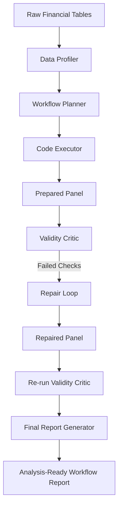

# 金融表格数据 Analysis-Ready Workflow Agent 原型系统说明

> 本文档是面向导师的项目总说明，汇总六阶段工作流的设计、产物与闭环结果。
> 配套英文产物见 `outputs/final_report/`，分阶段细节见 `docs/stage1~6_*.md`。

---

## 1. 项目背景

本项目**不是一个投资建议系统，也不是预测股票涨跌的模型**，而是一个面向金融/券商业务表格数据的**数据准备工作流原型**。

原始金融表格通常不能直接用于分析或建模，常见问题包括：

- **字段名不一致**：例如行情表用 `trade_date`、成交量表用 `date`；行情表用 `ticker`、成交量表用 `stock_code`，语义相同但命名不同。
- **缺失值**：价格、成交量、财务字段均可能缺失。
- **重复主键**：同一 `(date, ticker)` 出现多行，合并后会膨胀行数、错位标签。
- **跨表 schema mismatch**：多张表字段口径不一致，直接 join 会出错。
- **日期口径不一致**：交易日与非交易日混杂、停牌日缺失。
- **财务数据 report_date 与 announce_date 的时间可得性问题**：`report_date`（如季报截止日）通常在 `announce_date`（对外公告日）才披露，若按 `report_date` 对齐会用到未来才知道的信息。
- **label leakage**：把未来收益标签误当作特征，训练集准确率近 100% 但完全无效。
- **look-ahead bias（未来函数）**：rolling/pct_change 窗口或财务对齐用到了预测时点之后的数据，回测表现极好、实盘崩盘。
- **rolling window 使用未来数据的风险**：未按标的分组、或窗口方向错误，导致跨标的泄漏或用到未来行。

本项目目标是把原始金融表格转化为 **analysis-ready panel table（建模宽表）**，并且在过程中保留可审计的 **profile、plan、execution log、validation report 和 repair log**，使整个数据准备过程可追溯、可解释、可复审。

---

## 2. 项目目标

本项目的目标是构建一个 **task-aware、validity-aware、workflow-based** 的金融表格数据准备原型系统。

它从原始金融表格出发，根据下游任务生成数据准备计划，执行生成建模宽表，再通过 Validity Critic 检查时间因果性、标签泄漏和特征可用性。如果发现失败项，Repair Loop 会生成修复方案并重新验证。

**重点不是预测收益率，而是验证**：

- 系统能否**自动识别**原始表格中的问题；
- 系统能否根据下游任务**生成合理的数据准备流程**；
- 系统能否**执行流程并产出 prepared panel**；
- 系统能否发现**普通表格检查难以覆盖的有效性问题**（未来函数、标签泄漏、时间对齐）；
- 系统能否根据 Critic 反馈**完成修复闭环**。

因此，本项目的交付物是"一份干净的、可安全建模的宽表 + 全流程审计产物"，而不是"一个预测模型"或"一份投资建议"。

---

## 3. 当前完成的核心阶段

目前已经完成**六个阶段**，其中前五个是核心工作流阶段，第六个是报告汇总阶段：

1. Data Profiler（数据剖析）
2. Workflow Planner（工作流规划）
3. Code Executor（代码执行）
4. Validity Critic（有效性审查）
5. Repair Loop（修复闭环）
6. Final Report Generator（最终报告生成）

| 阶段 | 模块 | 主要输入 | 主要输出 | 作用 |
|---|---|---|---|---|
| 1 | Data Profiler | 原始 5 张 CSV | `profile.json`、`profile_report.md` | 剖析原始表：schema/dtype/缺失/重复/日期/代码/跨表不一致 |
| 2 | Workflow Planner | `profile.json` + analysis_goal | `workflow_plan.json`、`workflow_plan_report.md` | 根据任务目标生成有序、可执行、可校验的数据准备计划 |
| 3 | Code Executor | 原始 CSV + `workflow_plan.json` | `prepared_panel.csv`、`data_dictionary.json`、`execution_log.json`、`execution_report.md` | 按 plan 用 pandas 真正执行，产出 analysis-ready 宽表（防未来函数） |
| 4 | Validity Critic | `prepared_panel.csv` + 字典 + 日志 + plan + 源码 | `validation_report.json`、`validation_report.md`、`approved_feature_columns.json` | 审查未来函数/标签泄漏/announce_date 对齐/时间切分等有效性问题 |
| 5 | Repair Loop | `prepared_panel.csv` + `validation_report.json` | `repair_plan.json`、`repaired_panel.csv`、`repair_log.json`、`repair_report.md` | 读 Critic failed 项，生成可解释修复方案并执行 |
| 6 | Re-run Critic + Report | `repaired_panel.csv` + 前五阶段全部产物 | `validation_repaired/*`、`final_report/*` | 复审确认修复 + 汇总六阶段总报告 |

每个模块说明如下：

### 3.1 Data Profiler

Data Profiler 从原始金融表格出发，自动剖析：

- 字段；
- 数据类型；
- 缺失率；
- 重复行；
- 主键候选；
- 日期字段；
- 证券代码字段；
- 跨表字段不一致；
- schema mismatch；
- 潜在数据质量问题。

它还输出**跨表发现**（cross_table_findings），例如日期字段命名不一致、证券代码命名不一致、财务公告滞后提示等，为后续 Planner 提供决策依据。

它的输出包括：

- `profile.json`
- `profile_report.md`

### 3.2 Workflow Planner

Workflow Planner 读取 `profile.json` 和下游 analysis goal，生成数据准备计划。

它**不是简单套用固定清洗模板**，而是根据任务目标和 profiler 结果规划步骤，例如：

- 字段名统一；
- 日期解析；
- 主键去重；
- 交易日对齐；
- price 和 volume 合并；
- 计算 `return_1d`、`return_5d`、`volatility_20d`、`turnover_20d`；
- 使用 `announce_date` 对齐财务数据；
- 创建 `label_next_5d`；
- 规划 leakage checks。

当前版本生成 **13 个 workflow steps、12 个 validation checks、8 个 feature + 1 个 label**，每步标注依赖关系与泄漏风险。

它的输出包括：

- `workflow_plan.json`
- `workflow_plan_report.md`

### 3.3 Code Executor

Code Executor 根据 `workflow_plan.json` 执行确定性 pandas 处理流程，生成建模宽表。

它完成：

- 读取 price、volume、fundamentals、industry、calendar；
- 标准化字段名；
- 解析日期；
- 去重；
- 对齐交易日；
- 合并行情和成交量；
- 生成历史特征；
- 使用 `announce_date` 做 as-of merge；
- 创建 `label_next_5d`；
- 输出 `prepared_panel.csv`。

防未来函数的关键实现：所有 rolling/pct_change 按 `ticker` 分组只用历史窗口；财务用 `pd.merge_asof(direction='backward')` 按 `announce_date` 对齐；标签用 `shift(-5)` 生成并标注 `role=label`。

它的输出包括：

- `prepared_panel.csv`
- `data_dictionary.json`
- `execution_log.json`
- `execution_report.md`

### 3.4 Validity Critic

Validity Critic **不是普通数据质量检查**，而是检查 prepared panel 是否真的适合下游建模。

它检查更高层次的有效性问题，例如：

- label leakage；
- look-ahead bias；
- `label_next_5d` 是否被错误放入特征列；
- fundamentals 是否按 `announce_date` 对齐；
- `announce_date` 是否满足 `announce_date <= date`；
- rolling window 是否只使用历史数据；
- 是否使用 groupby ticker 避免跨标的泄漏；
- `date + ticker` 主键是否唯一；
- 是否需要 time-based train/test split；
- 价格、成交量、成交额是否合理。

它不仅看 panel 本身，还读 `executor.py` 源码做静态分析（验证 `merge_asof` + `announce_date`、无非 label 的 `shift(-k)`），并生成 `approved_feature_columns` 从结构上杜绝标签进入特征矩阵。

它的输出包括：

- `validation_report.json`
- `validation_report.md`
- `approved_feature_columns.json`

### 3.5 Repair Loop

Repair Loop 读取 Critic 的 failed checks，根据失败原因生成修复方案，并重新运行 Critic 验证修复效果。

它体现的是：

**发现问题 → 生成修复策略 → 执行修复 → 重新验证**

而不是简单报告错误。每个修复动作都带 `target_check`/`strategy`/`reason`/`risk`，可审计、可追溯。

它的输出包括：

- `repair_plan.json`
- `repaired_panel.csv`
- `repair_log.json`
- `repair_report.md`
- `validation_repaired/validation_report.json`（复审 Critic 产物）

### 3.6 Final Report Generator

Final Report Generator 汇总前五阶段产物，生成完整可读的项目报告和一页摘要。它只读输入、不重跑任何阶段。

它的输出包括：

- `final_workflow_summary.json`
- `final_workflow_report.md`
- `final_workflow_one_page.md`
- `pipeline_artifacts_index.json`

---

## 4. 整体工作流



工作流的核心特征：

- **单向主链**：Profiler → Planner → Executor → Critic，每阶段消费上一阶段产物。
- **反馈支路**：Critic 失败时进入 Repair Loop，修复后**必须**重新运行 Critic 复审，由独立审查器判定是否真正修好。
- **收口**：Final Report Generator 把全部产物与闭环结果浓缩成可交付报告。

---

## 5. 闭环结果（关键数据）

本次运行的实际闭环结果（数据来自 `outputs/final_report/final_workflow_summary.json`）：

| 指标 | 修复前 | 修复后 |
|---|---|---|
| 行数 | 300 | 298 |
| `close` 缺失数 | 2 | 0 |
| Critic 总体状态 | **failed** | **passed_with_warnings** |
| failed 检查数 | 1 | 0 |
| 标签是否进入特征 | 否 | 否 |

一句话总结：

> 初始 300 行 → Critic failed（`close` 缺失 2 行）→ Repair 删除 2 行 → 298 行 → 复审 passed_with_warnings；`label_next_5d` 始终不在 approved feature columns 中。

- **初始** `prepared_panel.csv`：300 行 × 22 列，5 个 ticker，2024-01-02 ~ 2024-03-25，主键唯一。
- **初始 Critic**：15 项检查 14 passed / 1 failed。failed = `missing_rate_after_join`，`close` 缺失率 0.0067（2 行）。
- **Repair Loop**：策略 `drop_rows_with_missing_core_price`（保守删除，不插值），删除 2 行，产出 298 行 `repaired_panel.csv`。修复后自检：close 缺失=0、主键唯一、label 保留、label 不在 approved features。
- **复审 Critic**：15 项 14 passed / 1 warning / 0 failed。`close` 缺失率降为 0.0；剩余 warning 为 pe/pb/roe 高缺失（财务公告频率低，合理），非失败。
- **approved_feature_columns**（8 个特征，复审后不变）：`return_1d`、`return_5d`、`volatility_20d`、`turnover_20d`、`pe`、`pb`、`roe`、`industry_name`。
- **label_column**：`label_next_5d`（role=label），**不在** approved features 中——标签泄漏被结构性预防。

---

## 6. 为什么不只是表格检查

普通表格检查问"数据干不干净"（缺失/重复/dtype/异常），必要但远不足以建模。本工作流问的是更难、task-aware 的问题：**这份数据能不能安全地喂给一个时间序列模型而不泄漏未来？**

| 维度 | 普通表格检查 | 本工作流 |
|---|---|---|
| 关注点 | 缺失/重复/dtype/异常 | 未来函数、标签泄漏、时间有效性 |
| 失败后果 | 表脏但可清洗 | 模型看似有效实则无效，实盘灾难 |
| 检查对象 | 表本身 | 表 + 数据字典 + 执行日志 + plan + 源码 |
| 判定依据 | 统计阈值 | 时间因果性、role 标注、源码静态分析 |
| 失败时 | 报告并停止 | 修复 → 再审查闭环 |

具体体现在六点：

1. **task-aware 规划**：Planner 读 profile + 下游分析目标，输出有序、依赖明确、每步标注泄漏风险的计划。
2. **未来函数构造性预防**：rolling/pct_change 按 ticker 分组只用历史窗口；财务按 `announce_date` as-of 对齐，绝不用 `report_date`。
3. **标签泄漏预防**：`label_next_5d` 用 `shift(-5)` 生成，标注 `role=label`，结构性排除出 `approved_feature_columns`。
4. **时间有效性**：plan 要求 time-based train/test 切分，Critic 强制检查。
5. **源码级静态分析**：Critic 读 `executor.py` 源码验证 `merge_asof` + `announce_date` 且无非 label 的 `shift(-k)`。
6. **闭环自我修正**：Critic failed → Repair → 再 Critic 独立复审。

---

## 7. 目录结构与运行方式

```
financial_table_workflow_agent/
├── README.md
├── CODE_STRUCTURE.md            # 代码结构与模块职责
├── requirements.txt            # pandas + requests
├── .gitignore
├── data/real_market/           # 用户运行时下载的真实市场数据（不提交 Git）
├── test_data/real_market_sample/  # 小型真实测试 fixture（提交 Git，仅用于测试/最小演示）
├── src/                        # 六阶段源码 + CLI + 真实数据适配器
│   ├── real_data_adapter.py / run_fetch_real_data.py
│   ├── profiler.py / run_profile.py
│   ├── planner.py / run_planner.py
│   ├── executor.py / run_executor.py
│   ├── critic.py / run_critic.py
│   ├── repair.py / run_repair.py
│   ├── pipeline_runner.py / run_all.py / agent_shell.py
│   └── report_generator.py / run_report_generator.py
├── prompts/workflow_planner_prompt.md   # LLM Planner Prompt 模板（供后续接入）
├── outputs_real/               # 各阶段产物（不提交 Git）
│   ├── profiles/  plans/  prepared/
│   ├── validation/  repaired/  validation_repaired/
│   └── final_report/
└── docs/                       # 分阶段文档 + 本总说明
```

运行方式（从项目根目录，按顺序）：

```bash
pip install -r requirements.txt
python src/run_fetch_real_data.py --tickers 600519 --start_date 2024-01-01 --end_date 2024-01-10 --output_dir data/real_market --tradingagents_path D:\dwzq\TradingAgents-astock-main --no_snapshot_fundamentals
python src/run_profile.py    --input_dir data/real_market --output_dir outputs_real/profiles
python src/run_planner.py    --profile_path outputs_real/profiles/profile.json --output_dir outputs_real/plans
python src/run_executor.py   --input_dir data/real_market --plan_path outputs_real/plans/workflow_plan.json --output_dir outputs_real/prepared
python src/run_critic.py     --panel_path outputs_real/prepared/prepared_panel.csv --data_dictionary_path outputs_real/prepared/data_dictionary.json --execution_log_path outputs_real/prepared/execution_log.json --plan_path outputs_real/plans/workflow_plan.json --executor_source_path src/executor.py --calendar_path data/real_market/calendar.csv --output_dir outputs_real/validation
python src/run_repair.py     --panel_path outputs_real/prepared/prepared_panel.csv --validation_report_path outputs_real/validation/validation_report.json --data_dictionary_path outputs_real/prepared/data_dictionary.json --approved_features_path outputs_real/validation/approved_feature_columns.json --output_dir outputs_real/repaired
python src/run_critic.py     --panel_path outputs_real/repaired/repaired_panel.csv --data_dictionary_path outputs_real/prepared/data_dictionary.json --execution_log_path outputs_real/prepared/execution_log.json --plan_path outputs_real/plans/workflow_plan.json --executor_source_path src/executor.py --calendar_path data/real_market/calendar.csv --output_dir outputs_real/validation_repaired
python src/run_report_generator.py --profile_json outputs_real/profiles/profile.json --workflow_plan_json outputs_real/plans/workflow_plan.json --prepared_panel outputs_real/prepared/prepared_panel.csv --execution_log outputs_real/prepared/execution_log.json --initial_validation_report outputs_real/validation/validation_report.json --repair_plan outputs_real/repaired/repair_plan.json --repair_log outputs_real/repaired/repair_log.json --repaired_panel outputs_real/repaired/repaired_panel.csv --final_validation_report outputs_real/validation_repaired/validation_report.json --approved_features outputs_real/validation_repaired/approved_feature_columns.json --data_dictionary outputs_real/prepared/data_dictionary.json --output_dir outputs_real/final_report
```

> v3 已移除合成样例数据与自动生成逻辑；输入目录不存在/为空时明确失败，不再自动生成样例数据。
> 全流程离线运行（数据抓取阶段需网络），不调用外部 API，不连接真实券商交易系统。

---

## 8. 局限性

- 全部六阶段均为**确定性 baseline**，不调用任何 LLM API。
- v3 起使用**真实市场数据**（经适配器抓取的 A 股行情）；合成样例数据已移除。
- **不训练任何预测模型**，不做回测，不做策略评估。
- **不输出任何投资建议**，不连接真实券商/行情/交易系统。
- Critic 对 rolling 是否完全无未来函数的判断**部分依赖源码静态分析**，未实现动态执行追踪。
- Repair Loop 当前只实现 `close` 缺失的"删除行"策略；其他 failed 项记入 `not_repaired_items`，需人工处理。
- 最小修复**不重算**剩余行的依赖字段（return/volatility/label）；对当前样本因 rolling 用 `min_periods=1` 不破坏既有窗口，完整修复应回到 executor 在修复后输入上重跑。

---

## 9. 下一步

- **Multi Planner Voting**：多个 Planner 各出方案，投票/择优，提升鲁棒性。
- **LLM Planner / LLM Critic / LLM Repair 接入**：用 LLM 替换/增强规则组件（接口已就绪，输出结构不变即可无缝替换）。
- **baseline comparison**：rule-based vs single-agent vs multi-agent + critic，对比召回与误报。
- **真实券商数据接入**（超出当前范围；仍不做投资建议）。

> 以上均为后续阶段，当前六阶段原型已完成并自洽闭环。
