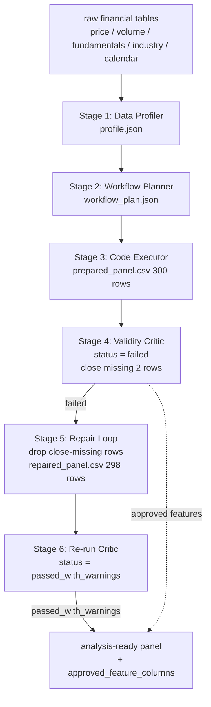

# Financial Table Analysis-Ready Workflow — Final Report

- project: `financial_table_workflow_agent`  |  report_version: `0.1`
- generated from stages: [1, 2, 3, 4, 5, 6]
- initial validation status: **failed**  →  final validation status: **passed_with_warnings**
- rows removed by repair: **2**

## 1. Executive Summary

This project turns raw, messy financial/brokerage tables (price, volume, fundamentals, industry, trading calendar) into an **analysis-ready modeling panel** through a six-stage agent workflow. It is **not** a one-shot table cleaner — it is a **task-aware analysis-ready workflow prototype** that plans around a downstream modeling goal, prevents look-ahead bias and label leakage by construction, and closes the loop with a critic → repair → re-critic cycle.

**Closed-loop result:**

- Initial `prepared_panel.csv`: **300 rows**.
- Initial Critic status: **failed** — failed check `missing_rate_after_join` (close has 0.0067 missing rate (2 rows); close is a core price field required by return features and the label).
- Repair Loop removed **2 rows** (missing `close`), producing `repaired_panel.csv` with **298 rows**.
- Re-run Critic status: **passed_with_warnings** (failed → 0).
- Label isolation: `label_next_5d` is **not** in approved feature columns (`label_not_in_approved_features = True`).

> initial 300 rows -> Critic failed (close missing 2 rows) -> Repair removed 2 rows -> 298 rows -> re-run Critic passed_with_warnings; label label_next_5d kept out of approved features

## 2. Pipeline Architecture (Mermaid)

## 3. Why This Is More Than Table Checking

A naive table checker asks "is the data clean?" — missing rates, duplicates, dtypes, outliers. That is necessary but **nowhere near sufficient** for modeling. This workflow asks the harder, task-aware question: **can this panel be safely fed to a time-series model without leaking the future?**

What makes it more than table checking:

1. **Task-aware planning.** The Planner reads the profiler output *and* a downstream analysis goal (5-day return prediction / factor analysis) and emits an ordered, dependency-respecting plan with explicit leakage risks per step — not a generic cleaning recipe.
2. **Look-ahead bias prevention by construction.** Rolling/pct_change features are grouped by ticker and use only historical windows; fundamentals are aligned by `announce_date` (as-of merge), never `report_date`. The financial future function is the analogue of clinical time leakage.
3. **Label leakage prevention.** `label_next_5d` (future 5-day return) is generated with `shift(-5)`, marked `role=label` in the data dictionary, and structurally excluded from `approved_feature_columns` — so a downstream model literally cannot read the label as a feature.
4. **Temporal validity.** The plan requires time-based train/test split (no random shuffling of time series); the Critic enforces that the plan demands it.
5. **Source-level static analysis.** The Critic does not just look at the panel — it reads `executor.py` source to verify `merge_asof` + `announce_date` and that no non-label `shift(-k)` exists.
6. **Closed-loop self-correction.** When the Critic fails (close missing), the Repair Loop consumes the failure, emits an explainable repair action, and the Critic is re-run independently to confirm the fix. A table checker reports a problem and stops; this workflow **fixes and re-verifies**.

| Dimension | Ordinary table checking | This workflow |
|---|---|---|
| Focus | missing/duplicate/dtype/outlier | future-function, label leakage, temporal validity |
| Failure consequence | dirty but cleanable | model looks valid but is invalid; live disaster |
| Inspects | the table alone | table + data dictionary + execution log + plan + source |
| Verdict basis | statistical thresholds | time causality, role labels, source static analysis |
| On failure | report and stop | repair → re-critic closed loop |

## 4. Stage-by-Stage

### Stage 1 — Data Profiler

- Tables profiled: 5.

| table | n_rows | n_columns |
|---|---|---|
| calendar.csv | 94 | 2 |
| fundamentals.csv | 20 | 6 |
| industry.csv | 5 | 2 |
| price.csv | 302 | 6 |
| volume.csv | 295 | 4 |

Cross-table findings:

- `date_column_name_mismatch`: columns ['trade_date', 'date'] across ['price.csv', 'volume.csv'] — date fields have different names but likely same semantics
- `security_id_column_name_mismatch`: columns ['ticker', 'stock_code'] across ['price.csv', 'volume.csv'] — security id fields have different names but likely same semantics
- `fundamentals_lag`: columns ['report_date', 'announce_date'] across ['fundamentals.csv'] — financial data has announcement lag; report_date is NOT the available-as-of date
- fundamentals.csv has both report_date and announce_date; use announce_date (not report_date) as the available-as-of date to avoid look-ahead bias
- calendar.csv can be used as the trading-day alignment reference (is_trading_day flag)
- price.csv and volume.csv may have non-overlapping (date, ticker) keys; verify coverage before joining

### Stage 2 — Workflow Planner

- analysis_goal: 构建一个用于 5 日收益率预测或因子分析的股票/ETF 日频建模宽表。要求每一行是 ticker-date，特征只能使用当前日期及之前可获得的信息，生成 return_1d、return_5d、volatility_20d、turnover_20d、pe、pb、roe、industry 等字段，标签为未来 5 日收益率 label_next_5d，并检查是否存在未来函数或数据泄漏。
- 13 workflow steps, 12 validation checks, 8 features + 1 label.
- label: `label_next_5d` — label only; must be excluded from feature columns

### Stage 3 — Code Executor

- `prepared_panel.csv`: 300 rows × 22 columns, 5 tickers, 2024-01-02 ~ 2024-03-25, primary_key_unique=True.
- 11 steps executed, 3 warnings, 0 errors.
- Leakage-safe: rolling/pct_change grouped by ticker (historical window only); fundamentals aligned by `announce_date` via `merge_asof(direction='backward')`.

### Stage 4 — Validity Critic (initial)

- overall_status: **failed** (14 passed / 0 warnings / 1 failed of 15).
- Failed check: `missing_rate_after_join` — close has 0.0067 missing rate (2 rows); close is a core price field required by return features and the label.
- approved_feature_columns: ['return_1d', 'return_5d', 'volatility_20d', 'turnover_20d', 'pe', 'pb', 'roe', 'industry_name'].
- `label_next_5d` in approved features? **False** (must be False).

### Stage 5 — Repair Loop

- rows_before: 300 → rows_after: 298 (removed 2).
- action: `drop_rows_with_missing_core_price` on ['close'] — close is required for return features (return_1d/return_5d/volatility_20d) and label (label_next_5d); rows with missing close cannot be safely used for supervised modeling
- post-repair self-check: close_missing=0, primary_key_unique=True, label_preserved=True, label_not_in_features=True.

### Stage 6 — Re-run Critic (closed-loop verification)

- overall_status: **passed_with_warnings** (14 passed / 1 warnings / 0 failed of 15).
- `close` missing rate after repair: 0.0000 (was 0.0067 before).
- approved_feature_columns unchanged: ['return_1d', 'return_5d', 'volatility_20d', 'turnover_20d', 'pe', 'pb', 'roe', 'industry_name']; `label_next_5d` still not in features.

## 5. Closed-Loop Deep Dive

| metric | before repair | after repair |
|---|---|---|
| rows | 300 | 298 |
| close missing count | 2 | 0 |
| Critic overall_status | failed | passed_with_warnings |
| failed checks | 1 | 0 |
| label in approved features | False | False |

The loop is **feedback-driven** (Critic failure → repair), **explainable** (each action carries target_check/strategy/reason/risk), and **independently verifiable** (the re-run Critic — not the repairer — judges whether the fix held).

## 6. Approved Features & Label Isolation

- approved_feature_columns (8):
  - `return_1d` (role=feature)
  - `return_5d` (role=feature)
  - `volatility_20d` (role=feature)
  - `turnover_20d` (role=feature)
  - `pe` (role=feature)
  - `pb` (role=feature)
  - `roe` (role=feature)
  - `industry_name` (role=feature)

- label_column: `label_next_5d` (role=label).
- excluded_columns (14): ['date', 'ticker', 'open', 'high', 'low', 'close', 'volume', 'turnover', 'label_next_5d', 'source_price_available', 'source_volume_available', 'source_fundamental_available', 'source_industry_available', 'announce_date']
- Downstream modeling reads `approved_feature_columns.json` as X and `label_column` as y; the label cannot enter the feature matrix by construction.

## 7. Limitations

- Report Generator is a deterministic baseline; no LLM is called.
- It only reads prior-stage artifacts; it does not re-run any stage.
- No model is trained; no investment advice is produced.
- Only simulated sample data is used, not real broker data.
- Remaining warning after repair: pe/pb/roe high missing (low announce frequency, expected) and industry_name missing (simulated data design) — acceptable for baseline, not failures.

## 8. Next Steps

- Multi Planner Voting: several planners propose plans, vote/select.
- LLM Planner / LLM Critic / LLM Repair: replace/augment rule components.
- Baseline comparison: rule-based vs single-agent vs multi-agent + critic.
- Real broker data ingestion (out of current scope; no investment advice).
