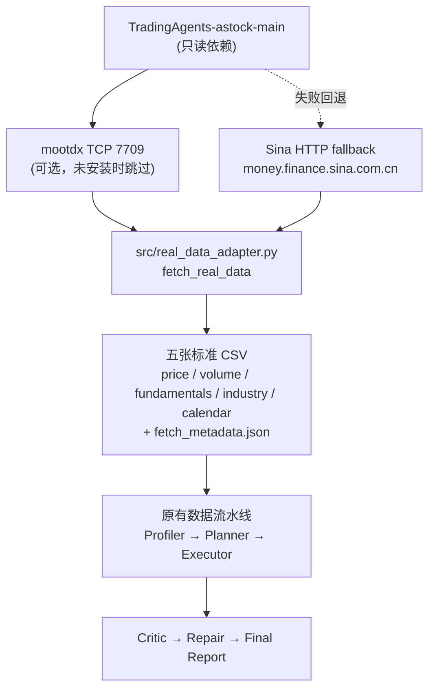

# Financial Table Analysis-Ready Workflow Agent

把原始金融/券商业务表格自动**剖析 → 清洗 → 校验**，最终生成可用于分析建模的 **analysis-ready table** 的 workflow agent 项目。

> 本项目与 NTU clinical table capstone 同构：金融数据准备的痛点（未来函数、字段口径不一致、交易日错位）与临床数据准备（时间泄漏、编码体系不一致、事件时间错位）一一对应。

---

## 1. 项目简介

构建一个以"数据准备"为核心的 workflow agent，把杂乱的原始金融表格（行情、成交、财务、行业、交易日历等）自动加工成一张干净的宽表（analysis-ready panel），供下游建模使用。**只做数据准备，不做选股/择时/收益预测，不训练模型，不输出投资建议，不连接真实券商交易系统。**

八个阶段全部为确定性 Python/Pandas 实现，**不调用任何 LLM API**，离线可运行（真实数据抓取阶段需联网，流水线处理本身离线）。

---

## 2. 2026-07-13 更新：真实 A 股数据接入（Stage 8，当前重点）

本日完成的工作是把参考项目 `TradingAgents-astock-main` 的真实 A 股行情获取能力接入当前项目，输出本项目约定的五张标准 CSV，并复用现有六阶段 workflow 完整处理真实数据。**这是当前版本的重点能力。**

- 新增 `src/real_data_adapter.py`（数据适配器）与 `src/run_fetch_real_data.py`（抓取 CLI）。
- 复用参考项目的 `_load_ohlcv_astock` / `_sina_kline_fallback` / `_normalize_ticker` / `_tencent_quote` / `_em_get`，**不复制逻辑、不修改参考项目**（参考项目是只读依赖）。
- 抓取结果落到 `data/raw_real/`（或自定义目录），通过 `run_all.py --input_dir` 或 `run_fetch_real_data.py --run_pipeline` 直接进入原有流水线。
- 缓存与日志写到当前项目的 `outputs/cache`，**不写入参考项目目录**。
- 严格遵守基本面时间点约束：腾讯 PE/PB 是当前快照，不是历史 point-in-time 数据，**不得回填到历史面板**（详见 [§8 时间对齐与防泄漏设计](#8-时间对齐与防泄漏设计)）。

---

## 3. 系统架构

### 3.1 真实数据链路



链路说明：

1. `real_data_adapter.py` 调用参考项目的 `_load_ohlcv_astock`；该函数内部优先 mootdx（TCP 7709），失败时自动走 Sina HTTP fallback。
2. mootdx 是**可选依赖**，未安装时参考项目内部直接走 Sina HTTP fallback，适配器无需特殊处理。
3. 适配器若 `_load_ohlcv_astock` 抛错，再直接调用 `_sina_kline_fallback` 作为第二道兜底。
4. OHLCV 严格按 `start_date ~ end_date` 过滤，按 (date, ticker) 去重并排序，数值列强制转数值，**禁止用随机/样例/前值填充伪造**。
5. 五张 CSV + `fetch_metadata.json` 落盘后，进入原有六阶段流水线。

### 3.2 阶段总览

```
raw financial tables
  → Data Profiler          ✅ Stage 1
  → Workflow Planner       ✅ Stage 2
  → Code Executor          ✅ Stage 3
  → Validity Critic        ✅ Stage 4
  → Remediation / Repair   ✅ Stage 5（闭环）
  → Re-run Critic          ✅ Stage 6（闭环验证）
  → Final Report Generator ✅ Stage 6（收口）
  → One-Click Runner + Agent Shell ✅ Stage 7（运行方式优化）
  → Real A-share Data Adapter ✅ Stage 8（真实数据接入，2026-07-13）
  → (Multi Planner Voting) ⏳ 计划
  → analysis-ready table
```

---

## 4. 快速开始

### 4.1 安装依赖

```powershell
pip install -r requirements.txt
```

依赖仅 `pandas>=1.5.0` 与 `requests>=2.32.0`。mootdx 为可选依赖，不安装时自动走 Sina HTTP fallback。

### 4.2 模拟数据演示（离线可复现）

```powershell
python src/run_all.py
```

`run_all.py` 一键运行完整 workflow（Profiler → Planner → Executor → Critic → Repair → Re-run Critic → Final Report），并在终端打印 summary dashboard。若 `data/sample/` 下没有 CSV，会自动生成模拟样例数据并提示。

可选参数：

```powershell
python src/run_all.py --input_dir data/sample --output_root outputs
python src/run_all.py --analysis_goal "构建一个用于 5 日收益率预测的日频建模宽表"
python src/run_all.py --no_repair        # 即使 critic failed 也不自动修复
python src/run_all.py --max_repair_rounds 3       # Remediation Agent 最大轮数（默认 3）
python src/run_all.py --max_row_loss_ratio 0.05   # 累计删行上限（默认 5%），超过转人工
python src/run_all.py --skip_report      # 跳过 Final Report Generator
python src/run_all.py --clean_outputs     # 运行前清空 outputs
python src/run_all.py --verbose           # 详细进度
```

### 4.3 交互式 Agent Shell

```powershell
python src/agent_shell.py
```

启动后进入交互式 shell，可用简单命令运行阶段、查看状态、查看失败项、查看 approved features、打开报告：

```
agent> help
agent> set goal 构建一个用于 5 日收益率预测的日频建模宽表
agent> run all
agent> show summary
agent> show failures
agent> show features
agent> open report
```

非交互测试模式（自动执行一组只读命令后退出）：

```powershell
python src/agent_shell.py --demo_commands
```

---

## 5. 真实数据抓取与运行

### 5.1 仅抓取真实数据

```powershell
python src/run_fetch_real_data.py --tickers 600519,000001,300750 --start_date 2024-01-01 --end_date 2024-06-30 --output_dir data/raw_real --tradingagents_path D:\dwzq\TradingAgents-astock-main
```

### 5.2 抓取并直接运行完整流水线（一条命令完成抓取 + 流水线）

```powershell
python src/run_fetch_real_data.py --tickers 600519,000001 --start_date 2024-01-01 --end_date 2024-06-30 --output_dir data/raw_real --tradingagents_path D:\dwzq\TradingAgents-astock-main --run_pipeline --output_root outputs_real
```

### 5.3 抓取时不取基本面快照（fundamentals.csv 只输出表头）

```powershell
python src/run_fetch_real_data.py --tickers 600519 --start_date 2024-01-01 --end_date 2024-01-10 --output_dir data/raw_real_verify --tradingagents_path D:\dwzq\TradingAgents-astock-main --no_snapshot_fundamentals
```

### 5.4 用已抓取的真实数据单独跑流水线

```powershell
python src/run_all.py --input_dir data/raw_real --output_root outputs_real
```

### 5.5 TradingAgents 项目路径解析优先级

1. 命令行 `--tradingagents_path` 显式传入
2. 环境变量 `TRADINGAGENTS_ASTOCK_PATH`
3. 默认路径 `D:\dwzq\TradingAgents-astock-main`
4. 相对路径 `..\TradingAgents-astock-main`

解析时校验 `tradingagents/dataflows/a_stock.py` 存在。本文档所有命令均使用真实路径 `D:\dwzq\TradingAgents-astock-main`。

### 5.6 网络访问要求

真实数据抓取需访问以下域名（参考项目直连 HTTP，零第三方数据库依赖）：

- `money.finance.sina.com.cn`（Sina K-line fallback）
- `qt.gtimg.cn`（腾讯 PE/PB 快照）
- `push2.eastmoney.com`（东财行业字段 f127）
- mootdx TCP 7709（若安装 mootdx；未安装时自动走 Sina HTTP fallback）

无法联网时明确标记"网络限制"，**不生成模拟数据冒充测试成功**。流水线处理本身离线可运行（只读已抓取的 CSV）。

---

## 6. 输入输出数据契约

### 6.1 五张标准 CSV

| 文件 | 列 | 说明 |
|---|---|---|
| `price.csv` | `trade_date, ticker, open, high, low, close` | 真实 OHLCV 的 OHLC 部分 |
| `volume.csv` | `date, stock_code, volume, turnover` | volume 来自真实 OHLCV；turnover 无可靠来源时留空，**不伪造** |
| `fundamentals.csv` | `report_date, announce_date, ticker, pe, pb, roe` | 当前快照，`announce_date = 抓取日期`；`report_date` 留空 |
| `industry.csv` | `ticker, industry_name` | 优先东财 f127 真实行业；失败时 `unknown` |
| `calendar.csv` | `date, is_trading_day` | 覆盖请求区间；有真实行情的日期标记 1，其余 0 |

OHLCV 严格按 `start_date ~ end_date` 过滤；按 (date, ticker) 去重（keep last）；按 date/ticker 排序；open/high/low/close/volume 转为数值。

### 6.2 fetch_metadata.json（审计信息）

每次抓取在输出目录生成 `fetch_metadata.json`，记录完整审计信息：

| 字段 | 含义 |
|---|---|
| `generated_at` / `fetch_date` | 抓取时间戳 / 抓取日期（`announce_date` 用此值） |
| `tradingagents_path` / `cache_dir` | 参考项目路径 / 缓存目录（当前项目 `outputs/cache`） |
| `requested_tickers` / `resolved_tickers` | 请求的代码 / 归一化后的 6 位代码 |
| `start_date` / `end_date` | 请求区间 |
| `ohlcv_source_by_ticker` | 每个 ticker 的行情来源标签：`internal_fallback` / `sina_http_direct` / `unknown`（**不猜测具体是 mootdx 还是 Sina**） |
| `rows_by_ticker` | 每个 ticker 的行情行数 |
| `per_ticker_errors` / `per_ticker_warnings` | 每个 ticker 的错误 / 警告 |
| `summary_rows` | 各输出表行数（price/volume/fundamentals/industry/calendar） |
| `output_files` | 各 CSV 绝对路径（正斜杠） |
| `fundamentals_limitation` | 明确说明当前快照非历史 point-in-time |
| `warnings` / `errors` | 全局警告 / 错误 |

**失败处理**：全部 ticker 抓取失败或 `price.csv` 为空时 `errors` 非空，CLI 返回非零退出码且**不运行后续流水线**；部分失败时继续处理成功 ticker，metadata 记录失败项。

### 6.3 流水线产物（Stage 1-6）

| 目录 | 关键产物 | 阶段 |
|---|---|---|
| `outputs/profiles/` | `profile.json` / `profile_report.md` | Stage 1 |
| `outputs/plans/` | `workflow_plan.json` / `workflow_plan_report.md` | Stage 2 |
| `outputs/prepared/` | `prepared_panel.csv` / `data_dictionary.json` / `execution_log.json` / `execution_report.md` | Stage 3 |
| `outputs/validation/` | `validation_report.json` / `validation_report.md` / `approved_feature_columns.json` | Stage 4 |
| `outputs/repaired/` | `repair_plan.json` / `repaired_panel.csv` / `repair_log.json` / `repair_report.md` | Stage 5 |
| `outputs/validation_repaired/` | 复审 Critic 产物 | Stage 5/6 闭环 |
| `outputs/final_report/` | `final_workflow_summary.json` / `final_workflow_report.md` / `final_workflow_one_page.md` / `pipeline_artifacts_index.json` | Stage 6 |
| `outputs/sessions/` | `latest_session.json` / `session_YYYYMMDD_HHMMSS.json` | Stage 7 |

`prepared_panel.csv` 为 analysis-ready 日频 ticker-date panel，字段含：主键（date, ticker）、行情（open/high/low/close）、成交量（volume/turnover）、特征（return_1d/return_5d/volatility_20d/turnover_20d/pe/pb/roe/industry_name）、标签（label_next_5d）、来源标志（source_*_available）、announce_date。`approved_feature_columns.json` 给出下游建模可直接使用的特征白名单，从结构上杜绝 label 进入特征矩阵。

---

## 7. 验证结果（2026-07-13 实测）

以下均为本日实际运行验证的结果，未夸大。运行环境：mootdx **未安装**，行情通过 Sina HTTP fallback 获取（`ohlcv_source_by_ticker = internal_fallback`）。

### 7.1 抓取结果

| 验证场景 | tickers | 区间 | price | volume | fundamentals | industry | calendar | ohlcv 源 |
|---|---|---|---|---|---|---|---|---|
| 小样本（`--no_snapshot_fundamentals`） | 600519 | 2024-01-01 ~ 2024-01-10 | 7 | 7 | 0（仅表头） | 1（白酒Ⅱ） | 10 | internal_fallback |
| 半年样本 | 600519 + 000001 | 2024-01-01 ~ 2024-06-30 | 234 | 234 | 2（当前快照） | 2（白酒Ⅱ / 银行Ⅱ） | 182 | internal_fallback |

- 小样本：calendar 10 天中 7 个交易日（01-02/03/04/05/08/09/10），01-01/06/07 为非交易日（`is_trading_day=0`）。
- 半年样本：calendar 182 天中 117 个交易日、65 个非交易日；price/volume 各 234 行（每只 ticker 117 行）。
- 半年样本 fundamentals.csv 含 2 行快照：600519 pe=18.11 pb=6.43；000001 pe=4.74 pb=0.45；roe 为空（mootdx finance 不可用时无法获取）；`announce_date = 2026-07-13`（抓取日期）。

### 7.2 完整流水线结果

| 指标 | 小样本（600519，10 天） | 半年样本（600519+000001，半年） |
|---|---|---|
| initial validation status | `passed_with_warnings` | `passed_with_warnings` |
| final validation status | `passed_with_warnings` | `passed_with_warnings` |
| prepared_panel 行数 | 7 | 234 |
| repaired_panel 行数 | 7 | 234 |
| rows_removed_by_repair | 0 | 0 |
| failed_checks（initial / final） | 0 / 0 | 0 / 0 |
| Critic 汇总（15 项检查） | 14 passed / 1 warning / 0 failed | 14 passed / 1 warning / 0 failed |
| `label_not_in_approved_features` | True（通过） | True（通过） |
| repair 阶段 | skipped（no_op_kind=`no_repair_needed`） | skipped（no_op_kind=`no_repair_needed`） |
| final_report | 已生成 | 已生成 |

### 7.3 关键检查项明细

- `label_not_in_approved_features`：**passed**。`label_next_5d` 不在 approved feature columns 中，label leakage 从结构上被阻止。
- `fundamentals_aligned_by_announce_date`：**passed**（`violation_count=0`，`n_fund_rows=0`）。
- `trading_calendar_alignment`：**passed**（panel 内所有日期均为交易日）。
- `price_volume_sanity`：**passed**（open/high/low/close > 0；volume >= 0）。
- `missing_rate_after_join`：**warning**（唯一 warning）。`close_missing_rate=0.0`，但 `pe/pb/roe` 缺失率均为 1.0（>20%），触发 `pe/pb/roe high missing (>20%)`。**这是防泄漏的正确行为，详见 [§8](#8-时间对齐与防泄漏设计)**。

### 7.4 无需 Repair 时的 no-op 产物

两次运行 initial critic 均未 failed（`passed_with_warnings`），流水线自动生成 no-op repair 产物，让 Final Report 正常生成：

- `repaired_panel.csv` = `prepared_panel.csv` 原样复制（行数不变）。
- `repair_plan.json` / `repair_log.json` / `repair_report.md` 标注 `no_op=true`、`no_op_kind=no_repair_needed`、`reason="initial critic did not fail; no repair needed"`。
- initial validation 报告复制为 repaired validation 报告。
- Final Report 动态读取实际结果，**不硬编码**行数与状态。

---

## 8. 时间对齐与防泄漏设计

### 8.1 基本面时间点约束（关键）

参考项目 `TradingAgents-astock-main` 中的 PE/PB/ROE 是**当前快照**（腾讯 `qt.gtimg.cn` 实时报价），**不是完整的历史 point-in-time 基本面数据库**。本项目严格遵守：

- 当前快照的 `announce_date` **必须**用真实抓取日期（`date.today()`，本日为 2026-07-13）。
- **不得**用用户指定的历史 `end_date` 作为当前快照的 `announce_date`。
- **不得**把当前快照复制到整个历史区间。
- `--no_snapshot_fundamentals` 或抓取失败时，输出**只有表头**的 `fundamentals.csv`。
- `fundamentals.csv` 为空时，流水线继续运行并产生 warning，**不崩溃**。
- **不允许**为了通过 Critic 而伪造 `announce_date`。

`fetch_metadata.json` 的 `fundamentals_limitation` 字段明确说明该限制。

### 8.2 为什么历史基本面为空并产生 warning（不是行情接入失败）

半年样本（600519+000001，2024-01-02 ~ 2024-06-28）的 `fundamentals.csv` 确实抓到了 2 行快照（pe/pb 有值，`announce_date=2026-07-13`），但 `prepared_panel.csv` 中 pe/pb/roe **全部为空**（0/234 非空），并触发 `missing_rate_after_join` warning。原因：

- Executor 用 `pd.merge_asof(direction='backward')` 按 `announce_date` 做 as-of 对齐：对每个 panel 行日期 `t`，只能使用 `announce_date <= t` 的最近一条财务记录。
- 快照的 `announce_date = 2026-07-13`，**晚于**所有 panel 日期（最大 2024-06-28），因此 backward as-of 找不到任何可用记录 → pe/pb/roe 为空。

**这是防止未来数据泄漏（look-ahead bias）的正确行为**：2026-07-13 才可知的快照不能回填到 2024 年面板，否则相当于在 2024 年用了未来信息。Critic 因此产生 warning（缺失率高），而非 failed；行情接入本身是成功的（price/volume 234 行真实数据齐全）。要获得历史 point-in-time 基本面，需接入专门的历史财务数据库，不在当前阶段范围。

### 8.3 其他防泄漏机制

- **rolling/pct_change 按 ticker 分组**，只用历史窗口（`return_1d`/`return_5d`/`volatility_20d`/`turnover_20d`）。
- **label 隔离**：`label_next_5d = close.shift(-5)/close - 1`（按 ticker 分组），在 data dictionary 标注 `role=label`，结构性地排除出 `approved_feature_columns`。
- **源码静态检查**：Critic 读取 `executor.py` 源码，验证 `merge_asof` + `announce_date` 存在、`report_date` 未用于对齐、无非 label 的 `shift(-k)`。
- **时间切分**：plan 要求 time-based train/test split，禁止随机打乱时间序列。
- **OHLCV 防未来函数截断**：`_load_ohlcv_astock` 的 `curr_date` 参数传 `end_date`，过滤掉晚于 `end_date` 的行情。

---

## 9. Stage 1-8 流水线说明

### Stage 1: Data Profiler（已完成）

```
raw financial tables → Data Profiler → profile.json → profile_report.md
```

纯确定性 Python/Pandas，不调用 LLM，离线可运行。剖析每张表的 schema/dtype/缺失值/日期列/证券代码列/数值列/日期范围/重复行/主键候选重复/数值统计/`potential_issues`，以及跨表发现（`trade_date` vs `date`、`ticker` vs `stock_code`、fundamentals 公告滞后等）。

### Stage 2: Workflow Planner（已完成）

```
profile.json + analysis_goal → Workflow Planner → workflow_plan.json → workflow_plan_report.md
```

确定性规则，不调用 LLM，离线可运行。读取 `profile.json`，结合下游分析目标，动态生成 13 个 workflow steps + 12 个 validation checks + 8 个特征 + 1 个标签 + 4 类排除列。**只规划，不执行代码，不生成 `prepared_panel.csv`**。已附带 LLM Planner Prompt 模板（`prompts/workflow_planner_prompt.md`）。

### Stage 3: Code Executor（已完成）

```
raw CSV + workflow_plan.json → Code Executor → prepared_panel.csv + data_dictionary.json + execution_log.json + execution_report.md
```

确定性 baseline，不调用 LLM，离线可运行。按 plan 的步骤用 pandas 真正执行数据处理，生成 analysis-ready 日频 ticker-date panel。严格防未来函数：rolling/pct_change 按 ticker 分组只用历史窗口；财务按 `announce_date` as-of 对齐（`merge_asof direction=backward`）；label 隔离。某 ticker 无基本面时补 `announce_date(NaT)` + pe/pb/roe(NA) 列，保证 panel 始终含 announce_date 列。

### Stage 4: Validity Critic（已完成）

```
prepared_panel.csv + data_dictionary.json + execution_log.json + workflow_plan.json + executor.py → Validity Critic → validation_report.json + validation_report.md + approved_feature_columns.json
```

确定性 baseline，不调用 LLM，离线可运行。对 prepared panel 做有效性审查（非普通质量检查）：未来函数、label leakage、announce_date 对齐、rolling 源码静态检查、time-based split 要求等 15 项检查。生成 `approved_feature_columns.json`，从结构上杜绝 label 进入特征矩阵。announce_date 列缺失时区分两种情况——无基本面值则 warning（正常），有基本面值却无 announce_date 则 failed（防时间泄漏）。

### Stage 5: Remediation / Repair Loop（已完成，有界多轮闭环）

```
prepared_panel.csv + validation_report.json → Remediation Agent → repair_plan.json + repaired_panel.csv + repair_log.json + repair_report.md + repair_history.json → (重新运行 Critic 复审)
```

确定性 baseline，不调用 LLM，离线可运行。v2（2026-07-14）升级为**有界多轮 Remediation Agent**：每轮 Observe（读最新 Critic 报告）→ Decide（strategy registry 选可执行策略或给 termination_reason）→ Act（在 panel 副本上 apply，安全门按实际行数复核）→ Reflect（重跑 Critic，记录 panel 指纹与 failed check 集合）→ Decide whether to continue。停止条件：`validation_passed` / `no_actionable_strategy` / `no_progress` / `max_rounds_reached` / `manual_review_required` / `stage_failed`。安全门：累计删行 > 原始 panel 的 5%（`--max_row_loss_ratio`）转人工；不伪造 `announce_date`；`label_next_5d` 永不进 `approved_feature_columns`；原始 CSV 不被覆盖。策略注册表含 `drop_rows_with_missing_core_price` / `drop_exact_duplicate_rows` / `trim_industry_name_whitespace`；未知 failed check 走 manual review，绝不猜测。审计文件 `repair_history.json` 即使 blocked/failed 也保存。详见 [docs/stage5_remediation_loop.md](./docs/stage5_remediation_loop.md)。

### Stage 6: Final Report Generator（已完成，收口）

```
前五阶段全部产物 → Final Report Generator → final_workflow_summary.json + final_workflow_report.md + final_workflow_one_page.md + pipeline_artifacts_index.json
```

确定性 baseline，不调用 LLM，离线可运行。**只读**前五阶段产物，不重新跑任何阶段、不重算任何字段。汇总六阶段 workflow 与闭环结果，明确说明这不是"普通表格检查"，而是 task-aware analysis-ready workflow prototype。总报告含 Mermaid 架构图与 "Why This Is More Than Table Checking" 小节；一页摘要适合直接发导师。**动态读取实际结果，不硬编码行数与状态**。

### Stage 7: One-Click Runner + Interactive Agent Shell（已完成，运行方式优化）

```
PipelineRunner 复用前六阶段内部类 → run_all.py（一键运行） + agent_shell.py（交互式 shell） → outputs/sessions/*.json
```

确定性 baseline，不调用 LLM，离线可运行。**不改动前六阶段核心逻辑**：`pipeline_runner.py` 只 import 并复用前六阶段内部类，原有 `run_*.py` CLI 全部保留、可独立运行。`run_all.py` 一键运行完整 workflow，打印 summary dashboard；`agent_shell.py` 提供交互式命令。每次运行生成 session log（latest + timestamped），记录每阶段 status/duration/error。回应导师反馈：从"一堆脚本"到"一键运行 + Agent Shell"。

### Stage 8: Real A-share Data Adapter（已完成，真实数据接入，2026-07-13）

```
TradingAgents-astock-main (只读依赖) → real_data_adapter.py → data/raw_real/*.csv + fetch_metadata.json → run_all.py --input_dir data/raw_real
```

详见 [§2](#2-2026-07-13-更新真实-a-股数据接入stage-8当前重点) 与 [§5](#5-真实数据抓取与运行)。只新增数据接入适配器与配套 CLI，**不修改前六阶段核心数据处理逻辑**（仅做必要的空基本面兼容与无需 Repair 时的 no-op 产物），**不修改参考项目**。`data/sample` 演示流程仍保留（`python src/run_all.py` 默认走模拟数据，保证离线可复现）。

---

## 10. 目录结构

```
financial_table_workflow_agent_v2/
├── README.md
├── requirements.txt                 # pandas + requests（mootdx 可选）
├── data/
│   ├── raw/                          # 原始数据（真实业务系统导出，留空）
│   ├── sample/                       # 模拟样例数据（generate_sample_data.py 生成）
│   ├── raw_real/                     # 真实抓取数据（Stage 8，.gitignore 忽略）
│   └── raw_real_verify/              # 真实抓取小样本验证（Stage 8，.gitignore 忽略）
├── src/
│   ├── __init__.py
│   ├── generate_sample_data.py       # 生成 5 张模拟 CSV
│   ├── profiler.py                   # FinancialTableProfiler (Stage 1)
│   ├── run_profile.py                # profiler CLI (Stage 1)
│   ├── planner.py                    # WorkflowPlanner (Stage 2)
│   ├── run_planner.py                # planner CLI (Stage 2)
│   ├── executor.py                   # CodeExecutor (Stage 3)
│   ├── run_executor.py               # executor CLI (Stage 3)
│   ├── critic.py                     # ValidityCritic (Stage 4)
│   ├── run_critic.py                 # critic CLI (Stage 4)
│   ├── repair.py                     # RepairLoop (Stage 5)
│   ├── run_repair.py                 # repair CLI (Stage 5)
│   ├── report_generator.py           # ReportGenerator (Stage 6)
│   ├── run_report_generator.py       # report generator CLI (Stage 6)
│   ├── pipeline_runner.py            # PipelineRunner 统一调度器 (Stage 7)
│   ├── run_all.py                    # 一键运行入口 (Stage 7)
│   ├── agent_shell.py                # 交互式 Agent Shell (Stage 7)
│   ├── real_data_adapter.py          # 真实 A 股数据适配器 (Stage 8)
│   └── run_fetch_real_data.py        # 真实数据抓取 CLI (Stage 8)
├── prompts/
│   └── workflow_planner_prompt.md    # LLM Planner Prompt 模板
├── outputs/                          # 模拟数据流水线产物 + cache + sessions
├── outputs_real/                     # 真实数据流水线产物（.gitignore 忽略）
├── outputs_real_verify/             # 真实数据小样本验证产物（.gitignore 忽略）
└── docs/
    ├── project_scope.md
    ├── project_overview_zh.md
    ├── stage2_workflow_planner.md
    ├── stage3_code_executor.md
    ├── stage4_validity_critic.md
    ├── stage5_remediation_loop.md
    ├── stage6_report_generator.md
    ├── stage7_agent_shell.md
    └── stage8_real_data_adapter.md
```

> 真实抓取数据与真实流水线产物（`data/raw_real/`、`data/raw_real_verify/`、`outputs_real/`、`outputs_real_verify/`、`outputs/cache/`）均由 `.gitignore` 忽略，运行时生成。

---

## 11. 已知限制

- **基本面非历史 point-in-time**：参考项目 PE/PB/ROE 是当前快照，不能回填到历史面板；历史区间内 pe/pb/roe 为空并产生 warning 是防泄漏的正确行为，不是行情接入失败。要获得历史 point-in-time 基本面需接入专门的历史财务数据库（后续计划）。
- **turnover 无可靠来源**：参考项目 OHLCV 不含成交额，`volume.csv` 的 turnover 留空，不伪造。
- **ROE 依赖 mootdx finance**：mootdx 不可用时 ROE 无法获取，留空。
- **mootdx 可选**：未安装 mootdx 时走 Sina HTTP fallback；海外网络下 mootdx TCP 7709 通常全部超时，Sina HTTP 是实际可用路径。
- **网络依赖**：真实数据抓取需联网；流水线处理本身离线可运行。
- **不训练模型、不输出投资建议、不连接真实券商交易系统、不做 Streamlit、不做多 Agent 投票**（当前阶段边界）。

---

## 12. 后续计划

- **历史 point-in-time 基本面数据库接入**：解决 pe/pb/roe 历史面板为空的问题。
- **Multi Planner Voting**：多个 Planner 各自出方案，投票/择优，提升鲁棒性。
- **LLM Planner / LLM Critic / LLM Repair 接入**：用 LLM 替换/增强规则组件。
- **baseline comparison**：rule-based vs single-agent vs multi-agent + critic。

> 以上均为后续阶段，**当前 Stage 8 不训练模型、不输出投资建议、不连接真实券商交易系统、不做 Streamlit、不做多 Agent 投票**。真实数据抓取需网络，流水线处理离线可运行。
